# Tutorial

## Project 01: Seesaw

### 1. Overview
It is well known that seesaw is sought-after among children. Usually, two children sit on both ends of the seesaw and step on the ground in turn to make one end rise and the other fall. However, in this project, we will work to make a seesaw that can rise and fall automatically.

### 2. Components
|||||
| :--: | :--: | :--: | :--: | 
|Kidsuno Mainboard×1|360°Servo×1|USB Cable×1| Lego Series×1 |

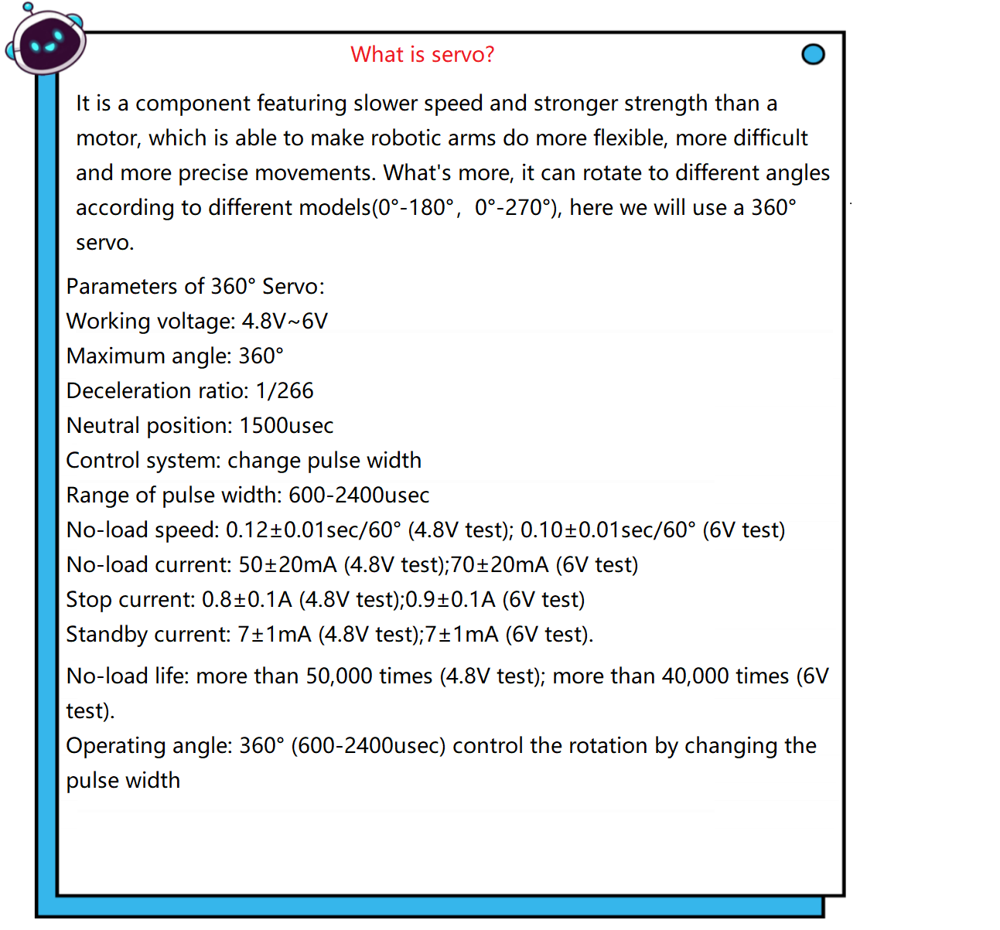

### 3. Make A Seesaw

### 4. Installation 
Please refer to the following link：https://www.dropbox.com/scl/fo/dtu6zv41pd82c71yb65q8/h?rlkey=kzegu8g8jkjieaeqfjxif6kii&dl=0

### 5. Programming Steps

##### Step1：Wiring Diagram
Connect the kidsuno mainboard and computer via a USB cable, and connect the 360° servo to the G, V and D13 interface of the mainboard. The brown wire is connected to G, the red wire is connected to V and the orange wire is connected to D13.
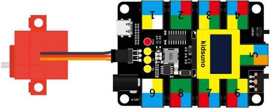

##### Step2：Add Servo

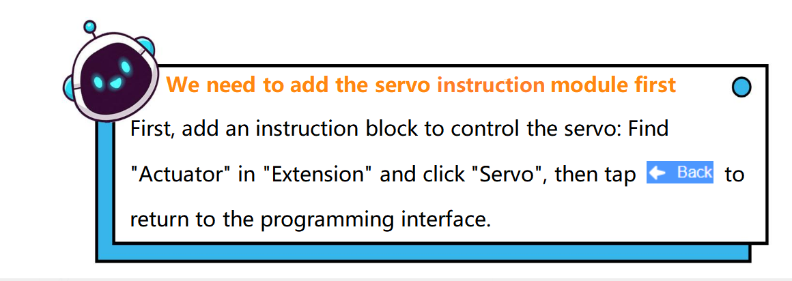

Diagram of the **Extension** Instruction Block

Add **Servo **Instruction Block 

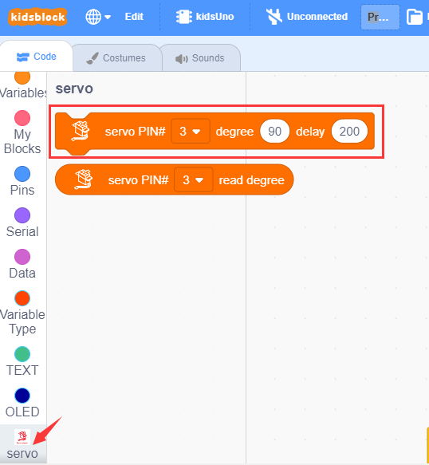

##### Step3: Description of Building Blocks

Set the angle value and delay to the specified pin. When the angle value is 90, the servo will stop rotating; if it is 0 ~ 90, the servo will rotate clockwise, the smaller the value, the faster the rotation speed;  if it is 90 ~ 180, the servo will rotate counterclockwise, the larger the value, the faster the rotation speed.

 Rotation of 180° Servo and 360° Servo ：

##### Step4：Write the Program
① Drag the instruction block in the **Events** module to the script area.

② Drag the instruction blockin the **Servo** module to the script area. Since the servo is connected to the G, V and D13 interface of the mainboard(The brown wire is connected to G, the red wire is connected to V and the orange wire is connected to D13), then change the number 3 to 13 and angle to any value within the range of 0 ~ 90 or 90 ~ 180. To make the servo rotate slowly, the angle value entered here is 60.

④ Complete Program

##### Step5：Test Result
Clickto upload the complete program to the kidsuno mainboard and power up, then the seesaw can rise and fall automatically.

### 6. Expansion Project
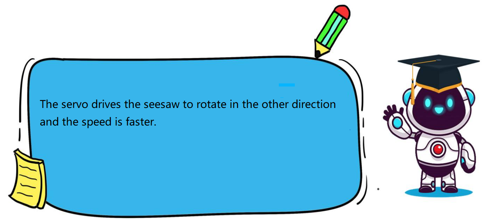

The sample code is below：
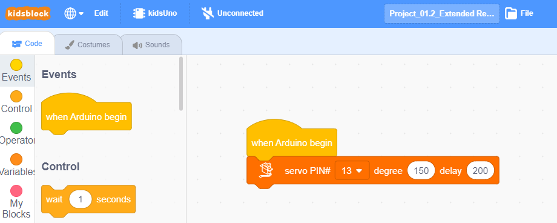

## Project 02: Mixer

### 1. Overview

Mixer is a kind of construction engineering machinery, which is mainly used for mixing some building materials such as cement, sand and gravel. In this project, we will seek to design a mixer.

### 2. Components
||||
| :--: | :--: | :--: |
|Kidsuno Mainboard×1|Digital Capacitive Touch Sensor×1|360°Servo×1|
||||
|Connection Wire×1|USB Cable×1| Lego Series×1 |

### 3. Installation 
Please refer to the following link：https://www.dropbox.com/scl/fo/dtu6zv41pd82c71yb65q8/h?rlkey=kzegu8g8jkjieaeqfjxif6kii&dl=0

### 4. Read the Value of Digital Capacitive Touch Sensor

### 5. Programming Steps

##### Step 1：Wiring Diagram
Connect the kidsuno mainboard and computer via a USB cable, and connect the digital capacitive touch sensor to the No.2 interface, the 360° servo to the G, V and D13 interface of the mainboard. The brown wire is connected to G, the red wire is connected to V and the orange wire is connected to D13.
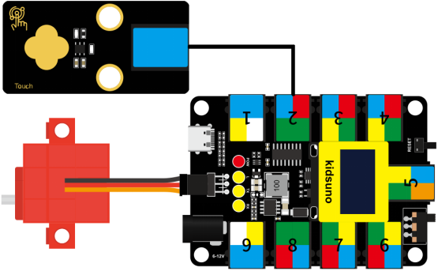

##### Step 2: Description of Building Blocks

The block is used to set serial baud rate(generally, the baud rate 9600 is taken as an example)

This block is used to set print mode for the serial port. **warp** means line feed printing, **no-warp** means no line feed printing, **HEX** means hexadecimal printing.

It is used to read the digital signal(0 or 1) of the specified pin

This is a command block used to set "**input**" or "**output**" to the specified pin.  "**input**" means input mode;  "**output**" represents output mode;  "**input-pullup**" means setting input mode for the pin and making the pin become high level (1).

This is a command block used to set "**high**" or "**low**" to the specified pin. "**high**" means high level(1)，LED will light up, "**low**" means low level(0)，LED will light off.

It is a delay module and 1 can be altered.

It is a forever module, it will execute one code forever.

##### Step 3：Write the Program
① Drag the instruction block in the **Events** module to the script area.

② Drag the instruction block in the **Serial** module to the script area and take the baud rate 9600 as an example.

③ Drag the instruction block
in the **Pins** module to the script area. Since the digital capacitive touch sensor is connected to D6 of No.2 interface on the mainboard, then change the number 0 to 6.

④ Drag the instruction block  in the **Control** module to the script area.
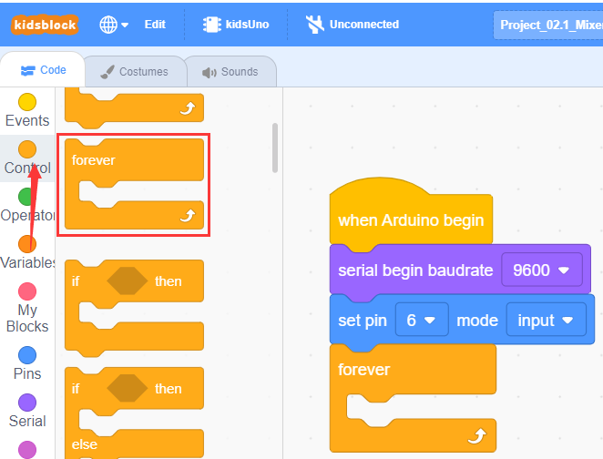

⑤Drag the instruction block in the **Serial** module to the script area.
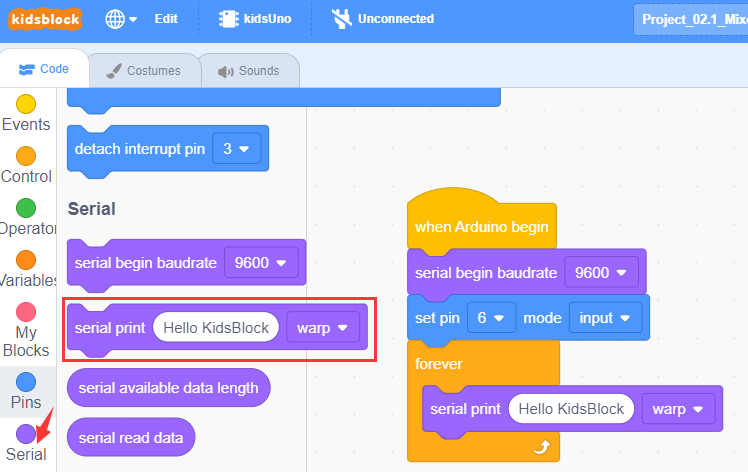

⑥ Drag the instruction block in the **Pins** module to the script area and put it into the block , then change the number 0 to 6.

⑦ Drag the instruction block in the **Control** module to the script area and change the number 1 to 0.2.

⑧ Complete Program
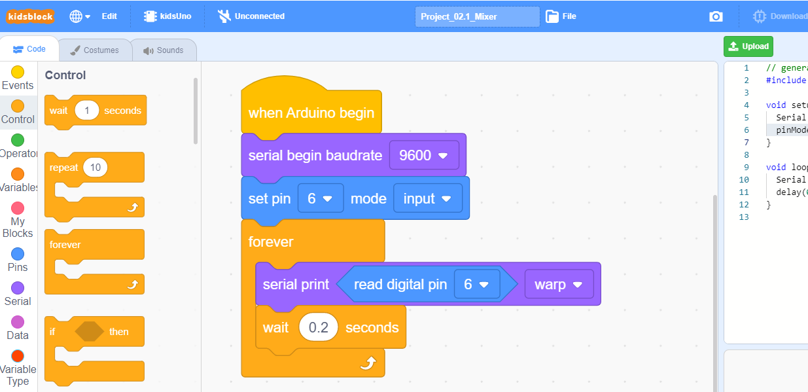

##### Step 4：Test Result
Clickto upload the complete program to the kidsuno mainboard and power up, then  click  in the serial monitor area to set the baud rate to 9600. Then the serial monitor will print the value read by the digital capacitive touch sensor. 

When your finger touches the plum-shaped metal sensing area on the sensor, it will output a high level (1); when released, it will output a low level (0).

### 6. Digital Capacitive Touch Sensor Controls Mixer to Rotate

### 7. Programming Steps

##### Step1: Description of Building Blocks

It is a conditional statement code executing **if-then-else ** function: If the logical judgment statement in  is satisfied, the code statement below **then** is executed, otherwise, the code below **else** is executed.

##### Step2：Flow Chart
Set the 360° servo angle to 90°. When you press (or touch) the metal sensing area on the sensor with your finger, the servo and the mixer will rotate, otherwise they won't rotate.

##### Step3：Add **Servo **Instruction Block 

##### Step4：Write the Program

① Find building blocks
（1）
    
（2）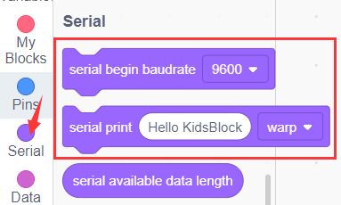
    
（3）
 
（4）
 
（5）
 
（6）
 

② Complete Program

##### Step5：Test Result
Clickto upload the complete program to the kidsuno mainboard and power up. When you press (or touch) the metal sensing area on the sensor with your finger, the servo and the mixer will rotate, otherwise they won't rotate.

### 10. Expansion Project
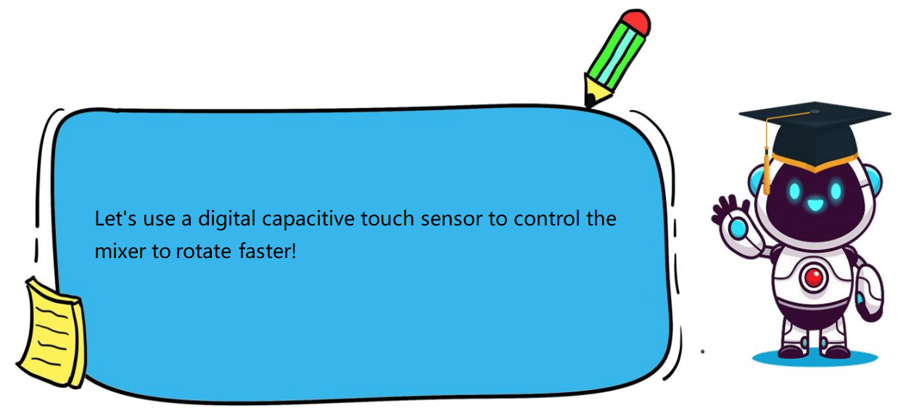

The sample code is below：

## Project 03: Windmill

### 1. Overview
In this project, we are going to make a mini windmill.

### 2. Components
||||
| :--: | :--: | :--: |
|Kidsuno Mainboard×1|Rotary Potentiometer×1|360°Servo×1|
|||| 
|Connection Wire×1|USB Cable×1| Lego Series×1 | 
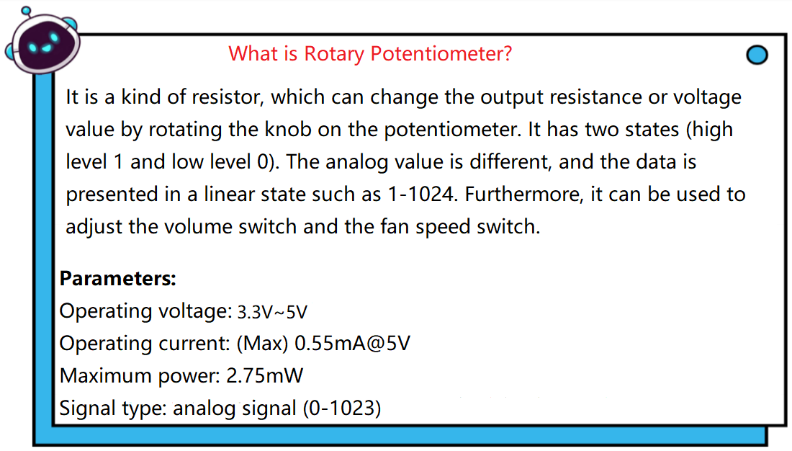

### 3. Installation 
Please refer to the following link：https://www.dropbox.com/scl/fo/dtu6zv41pd82c71yb65q8/h?rlkey=kzegu8g8jkjieaeqfjxif6kii&dl=0

### 4. Read the Value of Rotary Potentiometer

### 5. Programming Steps

##### Step 1：Wiring Diagram

Connect the kidsuno mainboard and computer via a USB cable, and connect the rotary potentiometer to the No.7 interface, the 360° servo to the G, V and D13 interface of the mainboard. The brown wire is connected to G, the red wire is connected to V and the orange wire is connected to D13.

##### Step 2: Description of Building Blocks

This block is used to read analog value of the specified pin (range: 0~1023).

##### Step 3：Write the Program
① Drag the instruction block in the **Events** module to the script area.

② Drag the instruction block in the **Serial** module to the script area and take the baud rate 9600 as an example.

③ Drag the instruction block
in the **Pins** module to the script area. Since the rotary potentiometer is connected to A0 of No.7 interface on the mainboard, then change the number 0 to A0.

④ Drag the instruction block  in the **Control** module to the script area.
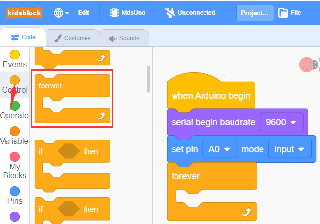

⑤ Drag the instruction block in the **Serial** module to the script area.

⑥ Drag the instruction block in the **Pins** module to the script area and put it into the block .

⑦ Drag the instruction block in the **Control** module to the script area and change the number 1 to 0.3.

⑧ Complete Program

##### Step 4：Test Result
Clickto upload the complete program to the kidsuno mainboard and power up, then  click  in the serial monitor area to set the baud rate to 9600. Then the serial monitor will print the value read by the rotary potentiometer. When the knob on the potentiometer is rotated in one direction, the analog value will gradually increase; otherwise, it will decrease.

### 6. Rotary Potentiometer Controls Windmill to Rotate

### 7. Programming Steps

##### Step1: Description of Building Blocks

This block is a mapping block, and mapping is a way of mapping each element (called a "key") in one data set to a unique element (called a "value") in another set. This correspondence can be represented in the form of a key-value pair, where each key corresponds to a value.

For example: how does the analog value of the rotary potentiometer correspond to the rotation angle of the 360° servo?
Here you need to use "mapping module" to map the analog value (0 ~ 1023) to the rotation angle of the 360° servo (90 °~180°). After mapping, when the analog value is 0, the angle of the servo is 90°(won't rotate), and when the analog value is 1023, the angle of the servo is 180° ( the servo speed is maximum), as shown below.

##### Step2：Flow Chart
Set the 360° servo angle to 90°. When the knob on the potentiometer is rotated, the analog value of the potentiometer is mapped to the angle of the servo to control its speed.

##### Step3：Add **Servo **Instruction Block 

##### Step4：Write the Program
①  Find building blocks
（1）
          
（2）
 
（3）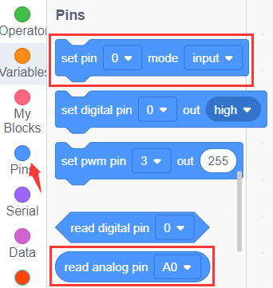
 
（4）
 
（5）
 
（6）
 

② Complete Program

##### Step5：Test Result
Clickto upload the complete program to the kidsuno mainboard and power up, then rotate the knob on the potentiometer by hand, and the speed of the windmill will gradually increase.

### 8. Expansion Project

The sample code is below：

## Project 04: Ferris Wheel

### 1. Overview

When it comes to the Ferris wheel, we must be familiar with it. Sitting on the Ferris wheel, we are able to overlook the surrounding scenery from a height. Thus, in this project, we will work to make a Ferris wheel that can be viewed in the rain.

### 2. Components
|||||
| :--: | :--: | :--: | :--: |
|Kidsuno Mainboard|Steam Sensor×1|Passive Buzzer×1|360°Servo×1|
|||| |
|Connection Wire×2|USB  Cable×1| Lego Series×1 | |
|||||

### 3. Installation 

Please refer to the following link：https://www.dropbox.com/scl/fo/dtu6zv41pd82c71yb65q8/h?rlkey=kzegu8g8jkjieaeqfjxif6kii&dl=0

### 4. Play Music

### 5. Programming Steps

##### Step1：Wiring Diagram

Connect the kidsuno mainboard and computer via a USB cable, and connect the steam sensor to No.7 interface, passive buzzer to No.6 interface and the 360° servo to the G, V and D13 interface of the mainboard. The brown wire is connected to G, the red wire is connected to V and the orange wire is connected to D13.

##### Step2: Write《Twinkle, twinkle, little star!》
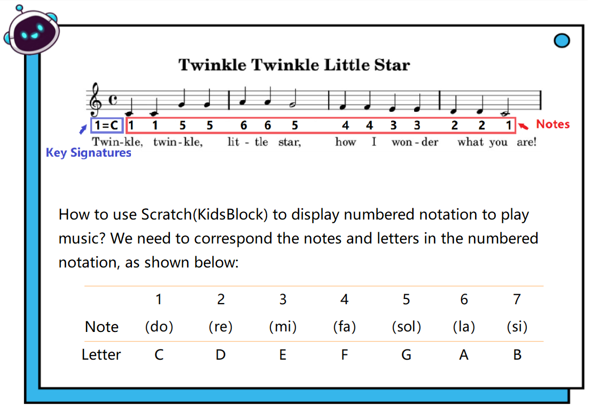

##### Step3：Add Passive Buzzer Command Module
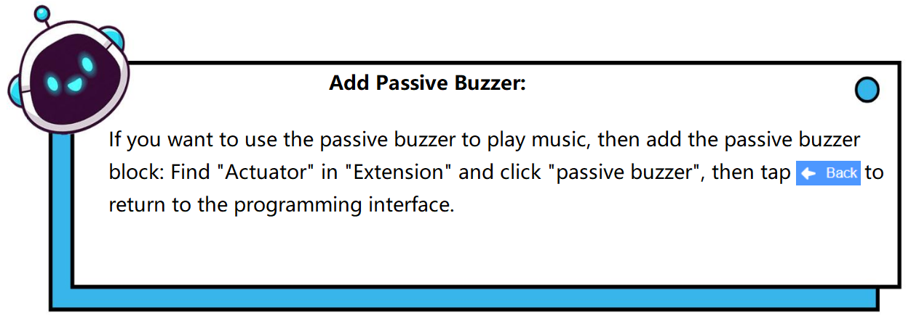

Diagram of the **Extension** Instruction Block

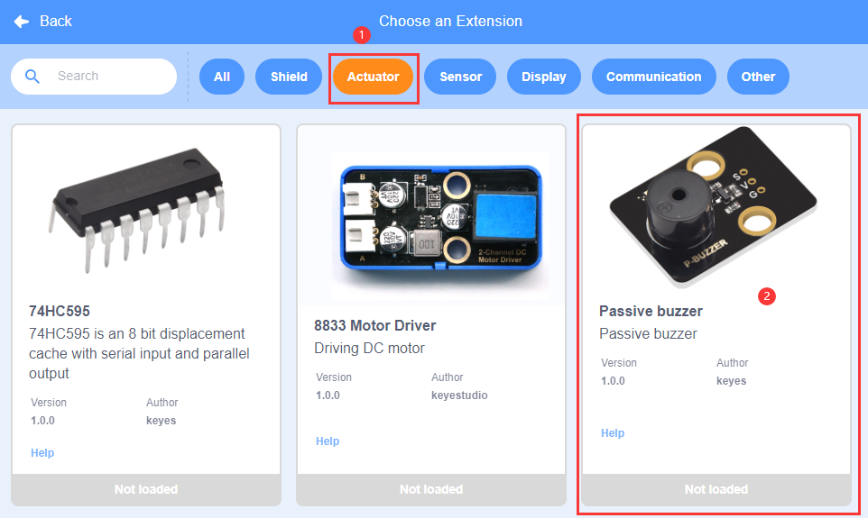
Add “**Passive Buzzer**” Instruction Block

##### Step4: Description of Building Blocks

Set the play frequency of the passive buzzer to the specified pin.

Set the play frequency and beat of the passive buzzer to the specified pin.

Set the passive buzzer to play specific music to the specified pin.

Set the passive buzzer to the specified pin without sound.

##### Step 5：Write the Program
① Drag the instruction block in the **Events** module to the script area.

② Drag the instruction blockin the **Passive Buzzer** module to the script area. Since the interface of the passive buzzer module is connected to the D4 pin of the No. 6 interface on the mainboard, change the number 2 to number 4. This module can play different notes via the parameter "NOTE_C4", and the parameter "1/4" can be used to adjust beat. (C4 refers to playing in the midrange state, where 4 represents the pitch of the note, and it can also be replaced by D4, G4 and A4 )
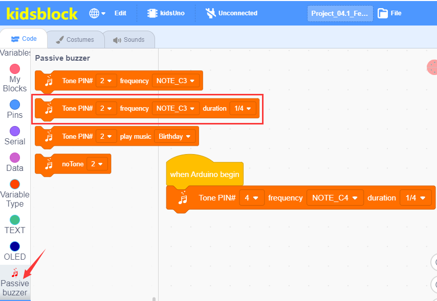

③ Duplicate13 times, then change NOTE_C4 and 1/4, as shown below:

④Drag the instruction blockin the **Passive Buzzer** module to the script area, then change the number 2 to number 4.
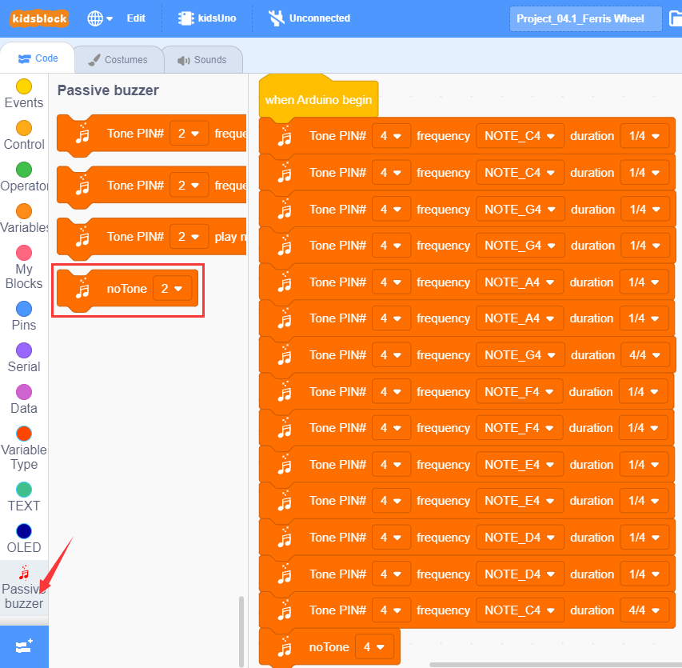

⑤ Complete Program
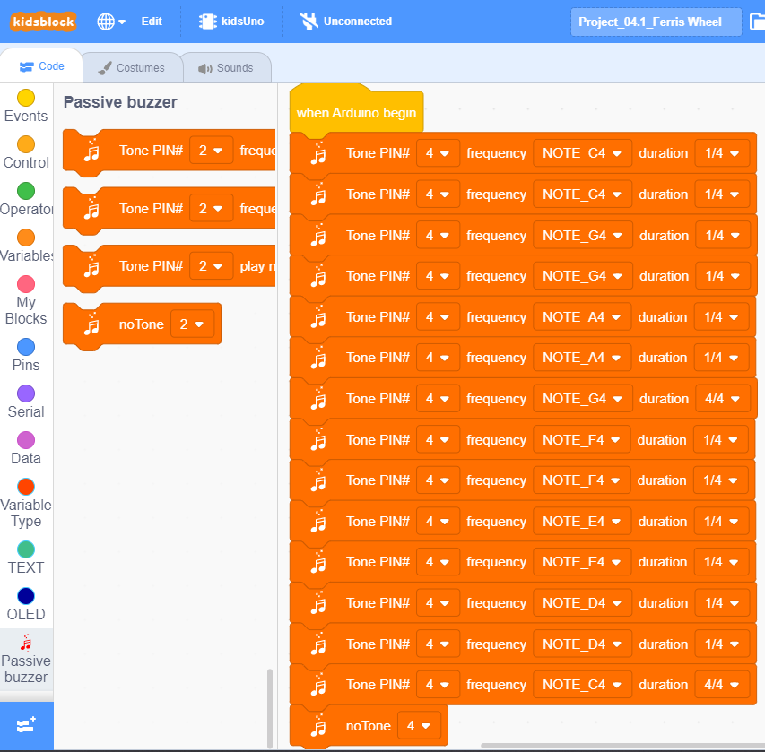

##### Step 6：Test Result
Clickto upload the complete program to the kidsuno mainboard and power up, then passive buzzer will play music.

### 6. Steam Sensor Detects Water
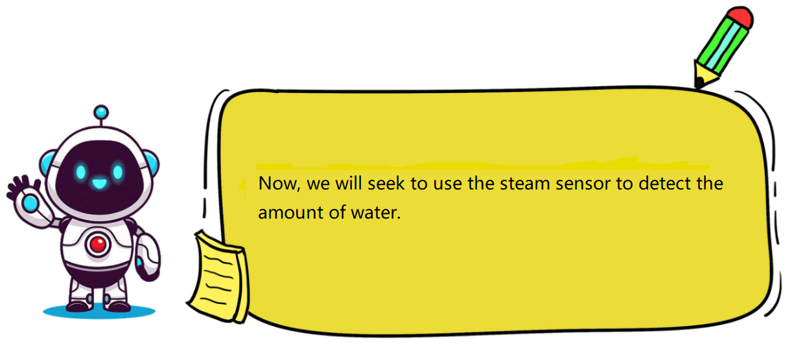

### 7. Programming Steps

##### Step1: Write the Program

① Drag the instruction block in the **Events** module to the script area.

② Drag the instruction block in the **Serial** module to the script area and take the baud rate 9600 as an example.

③ Drag the instruction block
in the **Pins** module to the script area. Since the steam sensor is connected to A0 of No.7 interface on the mainboard, then change the number 0 to A0 .

④ Drag the instruction block  )in the **Control** module to the script area.

⑤ Drag the instruction block in the **Serial** module to the script area.

⑥ Drag the instruction block in the **Pins** module to the script area and put it into the block .

⑦ Drag the instruction block in the **Control** module to the script area and change the number 1 to 0.3.

⑧ Complete Program

##### Step2：Test Result
Clickto upload the complete program to the kidsuno mainboard and power up, then  click  in the serial monitor area to set the baud rate to 9600. Then the serial monitor will print the value read by the steam sensor.

Touch the metal detection area on the sensor with a moistened finger, the larger the area, the greater the value!

### 8. Steam Sensor Controls Servo and Buzzer

### 9. Programming Steps

##### Step1: Flow Chart

Set the 360° servo angle to 90°, then read the analog value of the steam sensor. When the analog value is greater than 500, the servo and Ferris wheel will rotate, and the buzzer will play music; otherwise, the the servo and Ferris wheel will not rotate, and the buzzer does not sound.

##### Step2：Add **Servo **Instruction Block 

##### Step3：Write the Program
①  Find building blocks

（1）
    
（2）
    
（3）
 
（4）
 
（5）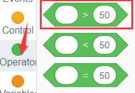
 
（6）
 
（7）
 

② Complete Program
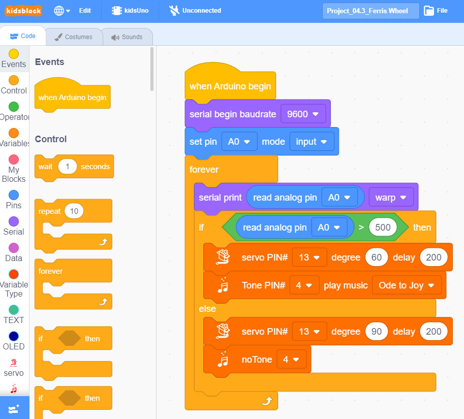

##### Step4：Test Result
Clickto upload the complete program to the kidsuno mainboard and power up, then drop water on the metal detection area of the sensor. When the analog value is greater than 500, the servo and Ferris wheel will rotate, and the buzzer will play music; otherwise, the the servo and Ferris wheel will not rotate, and the buzzer does not sound.

### 10. Expansion Project

The sample code is below：
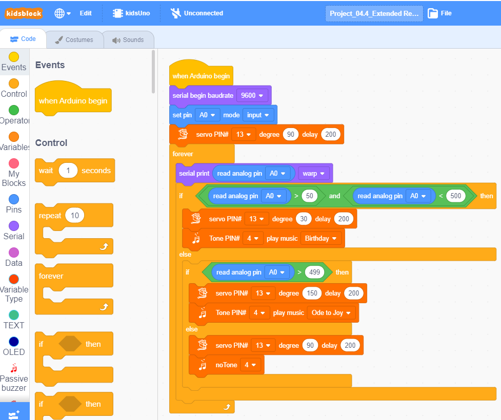

## Project 05: Rope Skipping Machine

### 1. Overview
Rope skipping machine is used to replace the traditional rope skipping method, which frees our hands. It can not only realize forward and reverse jumps, but also change the speed of skipping ropes according to needs.

### 2. Components
|||| |
| :--: | :--: | :--: | :--: |
|Kidsuno Mainboard×1|Joystick Module×1|360°Servo×1|Passive Buzzer×1|
||||  |
|Connection Wire×2|USB Cable×1| Lego Series×1 |  |

### 3. Installation 

Please refer to the following link：https://www.dropbox.com/scl/fo/dtu6zv41pd82c71yb65q8/h?rlkey=kzegu8g8jkjieaeqfjxif6kii&dl=0

### 4. Read the Value of Joystick Module

### 5. Programming Steps

##### Step1：Wiring Diagram

Connect the kidsuno mainboard and computer via a USB cable, and connect the joystick module to No.3 interface, passive buzzer to No.2 interface and the 360° servo to the G, V and D13 interface of the mainboard. The brown wire is connected to G, the red wire is connected to V and the orange wire is connected to D13.

##### Step2：Add Joystick Module 

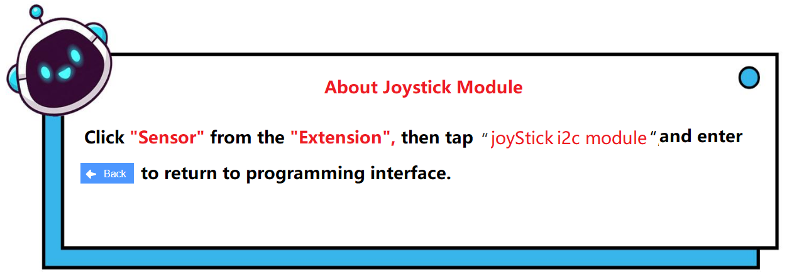

Diagram of the **Extension** Instruction Block

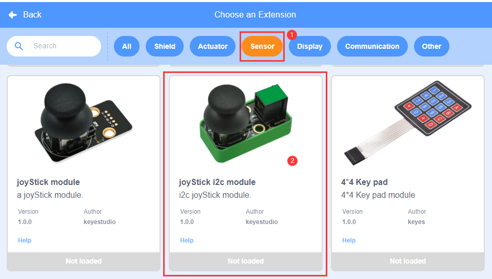
Add “**Joystick Module **” Instruction Block
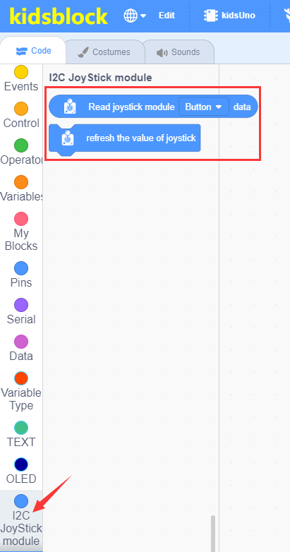

##### Step3: Description of Building Blocks

This block is used to read the analog value of the X-axis of the joystick module (range: 0~1023).

This block is used to read the analog value of the Y-axis of the joystick module (range: 0~1023).

This block is used to read the button value of the joystick module (1/0).

This block is used to refresh the value of the joystick module.

##### Step4：Write the Program
① Drag the instruction block in the **Events** module to the script area.

② Drag the instruction block in the **Serial** module to the script area and take the baud rate 9600 as an example.

③ Drag the instruction block  in the **Control** module to the script area.

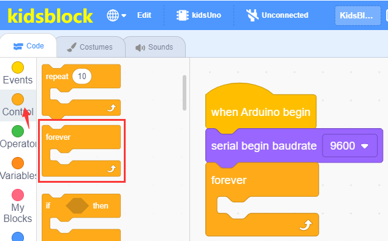

④ Drag the instruction blockin the **I2C Joystick Module ** module to the script area and place it into the block .

⑤ Drag the instruction block in the **Serial** module to the script area, then change “**Hello KidsBlock**” to “**X:**, **warp** to **no-warp**.

⑥ Drag the instruction block in the **Serial** module to the script area and place it into the block , then change **warp** to **no-warp**.

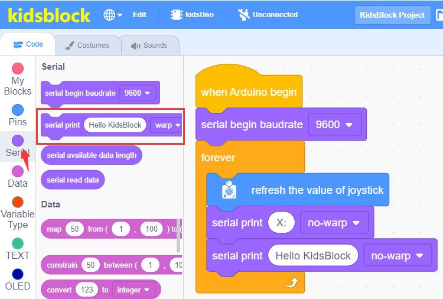

⑦ Drag the instruction blockin the **I2C Joystick Module ** module to the script area and place it into the block , then change “**button” to  X**.

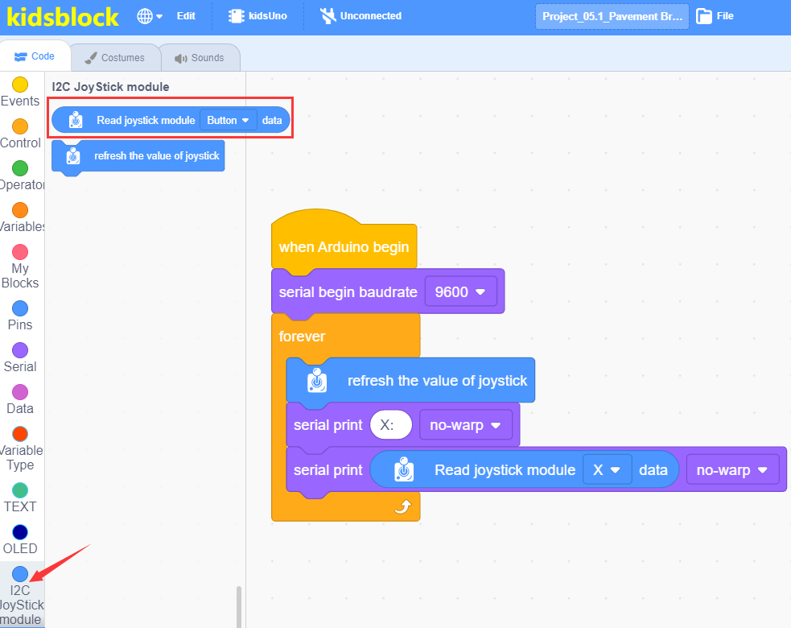

⑧ Copy blocktwice，then change “**X：** ” to “ **Y：** and “ **btn_val：**”，and change “**X**” to “**Y**” and “**button”**，the  **no-warp**  behind “**Button” **to **warp**.

⑨ Drag the instruction block in the **Control** module to the script area and change the number 1 to 0.2.

⑩ Complete Program

##### Step5：Test Result
Clickto upload the complete program to the kidsuno mainboard and power up,  then  click  in the serial monitor area to set the baud rate to 9600, then the serial monitor will print the analog and digital values read by the joystick module.

In the original state, the read analog values of X and Y are about 512. When moving in the direction of the arrow, the value gradually increases, as the arrow moves in the opposite direction, the value decreases gradually. When the joystick module is not pressed, it is low level (0); when pressed, it is high level (1).
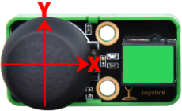
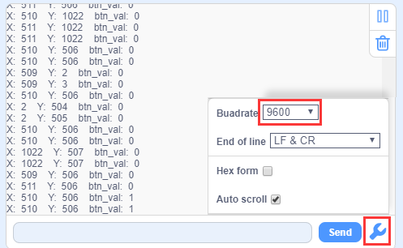

### 6. Joystick Module Controls Rope Skipping Machine

### 7. Programming Steps

##### Step1: Flow Chart

Set the 360° servo angle to 90°(won't rotate), then read values of the joystick module, if the X value is greater than 512, the rope skipping machine jumps from back to front and the speed changes, otherwise it jumps from front to back. Press the joystick module, passive buzzer will play music, otherwise it won't play music.

##### Step2：Add Servo and Passive Buzzer
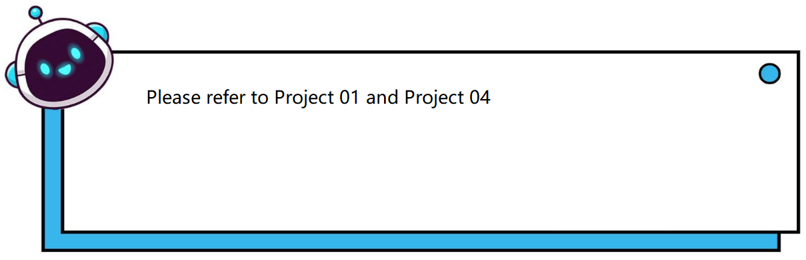

##### Step3：Write the Program

①  Find building blocks
（1）
          
（2）
 
（3）
 
（4）
 
（5）
 
（6）
 
（7）
 
（8）
 
② Complete Program

##### Step4：Test Result
Clickto upload the complete program to the kidsuno mainboard and power up, if the X value is greater than 512, the rope skipping machine jumps from back to front and the speed changes, otherwise it jumps from front to back. Press the joystick module, passive buzzer will play music, otherwise it won't play music.

### 8. Expansion Project

The sample code is below：

## Project 06: Breaker

### 1. Overview
Breaker is a machine that can level out uneven pavement. In this project, we will make one together!

### 2. Components
|||||
| :--: | :--: | :--: |:--: |
|Kidsuno Mainboard×1|Button Module×1|270° Servo×1|Connection Wire×1|
|||| |
|Wheel×4|USB Cable×1| Lego Series×1 | |
|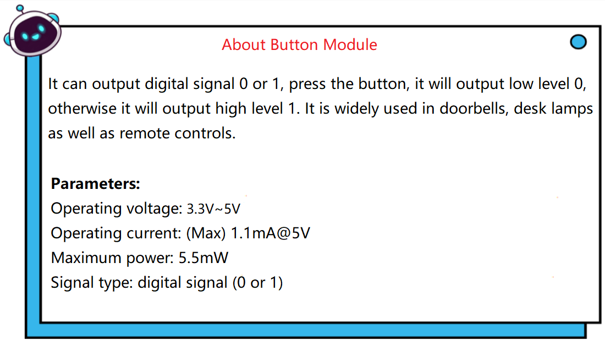|||

### 3. Installation 

Please refer to the following link：https://www.dropbox.com/scl/fo/dtu6zv41pd82c71yb65q8/h?rlkey=kzegu8g8jkjieaeqfjxif6kii&dl=0

### 4. Read the Button Value

### 5. Programming Steps

##### Step1：Wiring Diagram

Connect the kidsuno mainboard and computer via a USB cable, and connect the button module to No.2 interface and the 270° servo to the G, V and D13 interface of the mainboard. The brown wire is connected to G, the red wire is connected to V and the orange wire is connected to D13.

##### Step2: Description of Building Blocks
Please refer to Project 02: Mixer

##### Step3：Write the Program
① Drag the instruction block in the **Events** module to the script area.

②  Drag the instruction block in the **Serial** module to the script area and take the baud rate 9600 as an example.

③ Drag the instruction block
in the **Pins** module to the script area. Since the button module is connected to D6 of No.2 interface on the mainboard, then change the number 0 to 6 .

④ Drag the instruction block  in the **Control** module to the script area.

⑤ Drag the instruction block in the **Serial** module to the script area.

⑥ Drag the instruction block in the **Pins** module to the script area and put it into the block , then change the number 0 to 6.

⑦ Drag the instruction block in the **Control** module to the script area and change the number 1 to 0.2.

⑧ Complete Program

##### Step4：Test Result
Clickto upload the complete program to the kidsuno mainboard and power up, then  click  in the serial monitor area to set the baud rate to 9600. The serial monitor will print the value read by the button module, when you press the button on the module, it will output a low level (0); when you release it, it will output a high level (1).

### 6. Button Controls Breaker

### 7. Programming Steps

##### Step1: Description of Building Blocks

Variable block:

It is a conditional statement code executing **if-then ** function: If the logical judgment statement in  is satisfied, the code statement below **then** is executed.

It is a conditional loop statement, it will loop forever if the condition in  is satisfied.

##### Step2: Flow Chart

Set the 270° servo to 95°. When the button on the module is pressed, the long arm of the breaker will be raised; when released, it will be lowered. (press the button and then release it will complete a beat.) 

##### Step3：Add **Servo **

##### Step4：Write the Program
①  Find building blocks
（1）
 
（2）
 
（3）
 
（4）
 
（5）
 
（6）
 
（7）
 
（8）
 
② Complete Program

##### Step5：Test Result
Clickto upload the complete program to the kidsuno mainboard and power up. When the button on the module is pressed, the long arm of the breaker will be raised; when released, it will be lowered. (press the button and then release it will complete a beat.) 

## Project 07：Conveyor

### 1. Overview
Conveyor is a machine that can drive itself and carry goods, which is applied in complex and dangerous industrial environments to reduce the labor intensity of workers and improve work efficiency. In this project, we will work to make a small conveyor.

### 2. Components
|||||
| :--: | :--: | :--: | :--: |
|Kidsuno Mainboard×1|Ultrasonic Adapter×1|Ultrasonic Sensor×1|360°Servo×1|
|||| |
|Connection Wire×1|USB Cable×1| Lego Series×1 | |
|||||

### 3. Installation 

Please refer to the following link：https://www.dropbox.com/scl/fo/dtu6zv41pd82c71yb65q8/h?rlkey=kzegu8g8jkjieaeqfjxif6kii&dl=0

### 4. Read the Value of Ultrasonic Sensor

### 5. Programming Steps

##### Step1：Wiring Diagram

Connect the kidsuno mainboard and computer via a USB cable, connect the ultrasonic adapter module to the No. 9 interface of the mainboard. The Vcc, Trig, Echo, and Gnd of the ultrasonic sensor are correspondingly inserted into the same pins of the ultrasonic adapter module. Connect the 360° servo to the G, V and D13 interface of the mainboard. The brown wire is connected to G, the red wire is connected to V and the orange wire is connected to D13.

##### Step2：Add the Ultrasonic Sensor
Tap the "Sensor" module in the "Extension" , then select "**Ultrasonic Sensor**" and click to return to the programming interface.

Diagram of the **Extension** Instruction Block

“**Ultrasonic Sensor**” Instruction Block

##### Step3: Description of Building Blocks

This block is used to measure distance to the specified pin, and the distance unit can be cm or inch.

##### Step4：Write the Program
① Drag the instruction block in the **Events** module to the script area.

②  Drag the instruction block in the **Serial** module to the script area and take the baud rate 9600 as an example.

③ Drag the instruction blockin the **Pins** module to the script area and copy it. Since the ultrasonic sensor is connected to the No. 9 interface on the mainboard (Trig corresponds to D10 pin, Echo corresponds to D11 pin), then change the number 0 to 10 and 11 respectively, and  change the " **Input**" behind the number 10 to "**Output**".
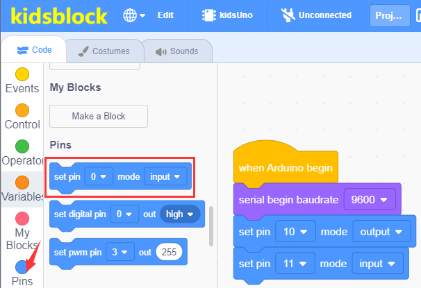

④ Drag the instruction block  in the **Control** module to the script area.
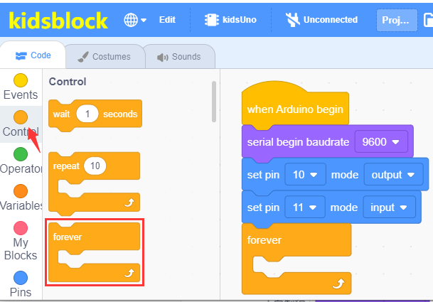

⑤ Drag the instruction block in the **Serial** module to the script area.
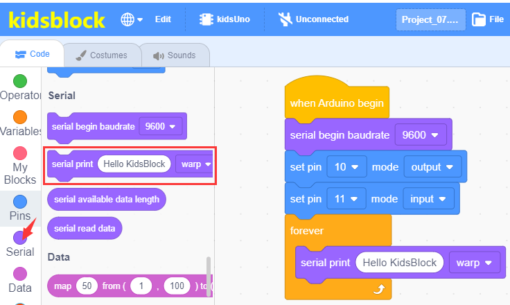

⑥ Drag the instruction block in the **Ultrasonic Sensor** module to the script area，then change the number 2 to 10 and 6 to 11.

⑦ Drag the instruction block in the **Control** module to the script area and change the number 1 to 0.3.

⑧ Complete Program

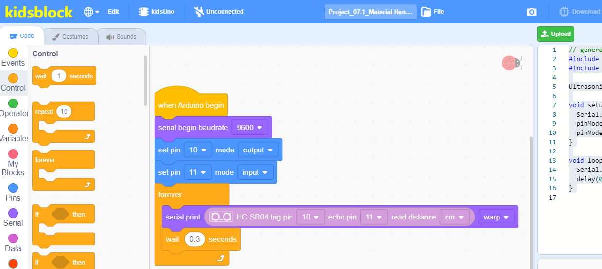

##### Step5：Test Result
Clickto upload the complete program to the kidsuno mainboard and power up, then  click  in the serial monitor area to set the baud rate to 9600. Move your hand in front of the ultrasonic sensor, when you get close to the ultrasonic sensor, you can see that the displayed distance value becomes smaller, otherwise it becomes larger.

### 6. Ultrasonic Sensor Controls Conveyor
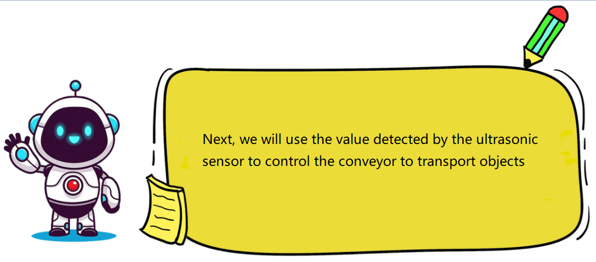

### 7. Programming Steps

##### Step1: Description of Building Blocks

This block is used to initialize the OLED's width, height and an I2C address.

This is a command block for drawing a straight line from the initial position x0:0 y0:0 to the final position x1:32 y1:16. The number in the block can be changed.

This is a command block that draws a recta with a width of 32 and a height of 16 from the initial position x:0 y:0, the numbers can be changed.

This is a command block that draws a rectangle with a width of 32 and a height of 16 from the initial position x:0 y:0, the numbers can be changed.

This is the command block that draws a circle with a radius of 8 starting from the initial position x:16 y:16.

This is the command block that fills a circle with a radius of 8 starting at an initial position of x:16 y:16.

This is the command block that draws a round rectangle with width 32, height 16, and radius 4 starting from an initial position of x:16 y:16.

This is the command block that fills a round rectangle with width 32, height 16 and radius 4 starting from initial position x:16 y:16.

This is the command block to draw a triangle from three positions x0:0 y0:0, x1:16 y1:0 and x2:8 y2:16.

This is the command block that fills the triangle between the three positions x0:0 y0:0, x1:16 y1:0 and x2:8 y2:16.

This is a command block for setting text size and color and background color.

This is the command block that sets the cursor position.

This is a command block for setting the way of printing strings on the OLED screen. "**warp"** means newline printing, "**no-warp**" means no newline printing.

This is the command block to set the OLED display pattern.

This is the command block to clear the OLED screen.

This is the command block to refresh the OLED screen and display the next content.

This is a command block that sets strings to start scrolling in a certain direction.

This is the command block to set stop scrolling

##### Step2: Flow Chart
Set the 360° servo to 90°, and read the distance value detected by the ultrasonic sensor. When the ultrasonic sensor detects that the distance from the object is greater than 1cm and less than 13cm, the conveyor starts to transport the object, and the OLED displays "Objects"; otherwise, the conveyor stops working and the OLED displays "No object".

##### Step3：Add **Servo **

##### Step4：Write the Program

①  Find building blocks
（1）
 
（2）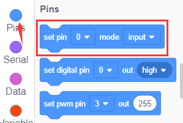
 
（3）
 
（4）
 
（5）
 
（6）
 
（7）
 
（8）
 
（9）
 
（10）
 
② Complete Program
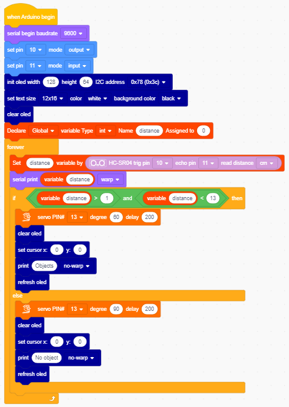

##### Step5：Test Result
Clickto upload the complete program to the kidsuno mainboard and power up, then put a larger object such as a sensor module on the track of the conveyor.

When the ultrasonic sensor detects that the distance from the object is greater than 1cm and less than 13cm, the conveyor starts to transport the object, and the OLED displays "Objects"; otherwise, the conveyor stops working and the OLED displays "No object".

### 8. Expansion Project
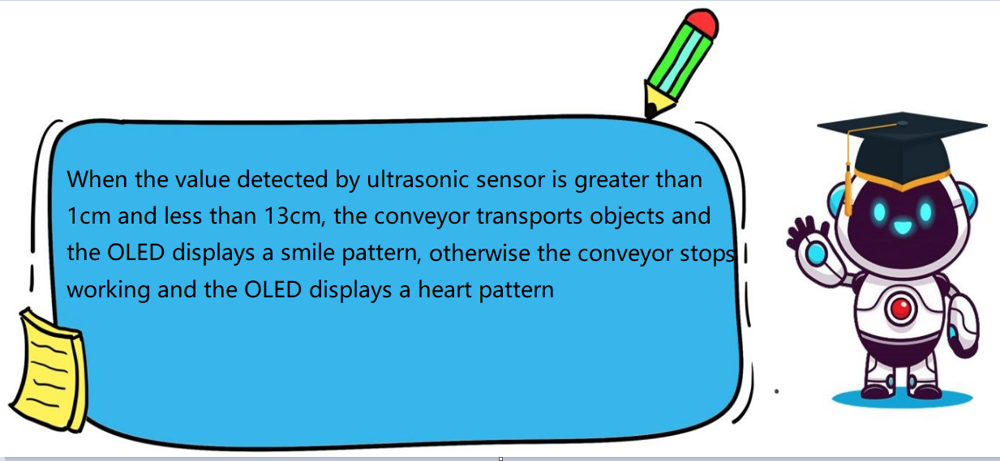

The sample code is below：
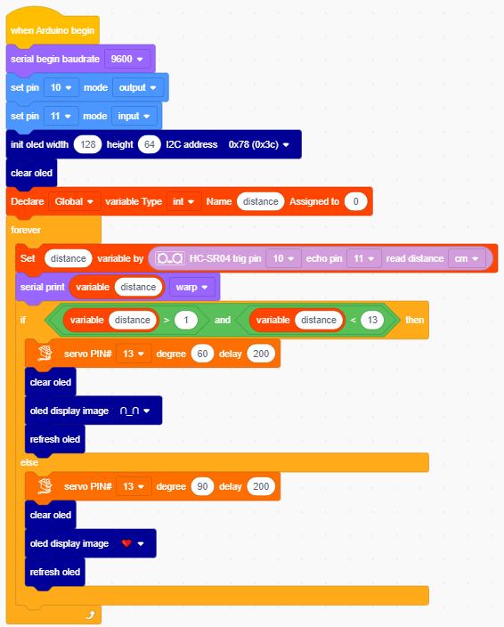

## Project 08：Large Crane

### 1. Overview
Crane is a machine that integrates loading, transportation and unloading, which is widely used in ports, workshops, electric power as well as construction sites. In this project, we will seek to make a large crane.

### 2. Components
|||| 
| :--: | :--: | :--: |
|Kidsuno Mainboard×1|IR Receiver×1|IR Remote Control×1|
||||
|360°Servo×1|270°Servo×1|Connection Wire×1|
||||
|USB Cable×1| Lego Series×1 |Wire×1|
|||||

### 3. Installation 

Please refer to the following link：https://www.dropbox.com/scl/fo/dtu6zv41pd82c71yb65q8/h?rlkey=kzegu8g8jkjieaeqfjxif6kii&dl=0

### 4. Read the Button Value of IR Remote Control

### 5. Programming Steps

##### Step1：Wiring Diagram

Connect the kidsuno mainboard and computer via a USB cable, connect the IR receiver module to the No. 2 interface of the mainboard. Then connect the 270° servo to the G, V and D12 interface, the brown wire is connected to G, the red wire is connected to V and the orange wire is connected to D12, the 360° servo to the G, V and D13 interface of the mainboard(brown wire: G, red wire: V , orange wire: D13).

##### Step2：Add the  IR Receiver 
Tap the "Communication" module in the "Extension" , then select " ** IR Receiver ** " and click to return to the programming interface.

Diagram of the **Extension** Instruction Block

Add “**IR Receiver **”

##### Step2: Description of Building Blocks

This block is used to initiate IR receiver to the specified pin.

This block is used to receive data from the IR remote control.

This block is used to read received IR data.

This block is used to refresh the IR received data and receive the next value.

##### Step3：Write the Program
①  Drag the instruction block in the **Events** module to the script area.

② Drag the instruction block in the **Serial** module to the script area and take the baud rate 9600 as an example.

③ Drag the instruction blockin the **IR Remote** module to the script area, since the IR receiver  module is connected to the D6 pin of the No. 2 interface on the mainboard, then change the number 2 to 6.
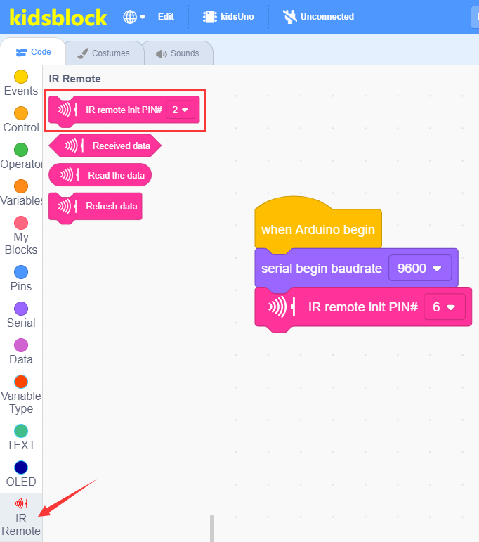

④ Drag the instruction block in the **Control** module to the script area.

⑤ Drag the instruction block  in the **Control** module to the script area.

⑥ Drag the instruction blockin the **IR Remote** module to the script area and place it into .

⑥ Drag the instruction block in the **Serial** module to the script area, then change “**warp**” to “**HEX**”.

⑥Drag the instruction blockin the **IR Remote** module to the script area and place it into

.
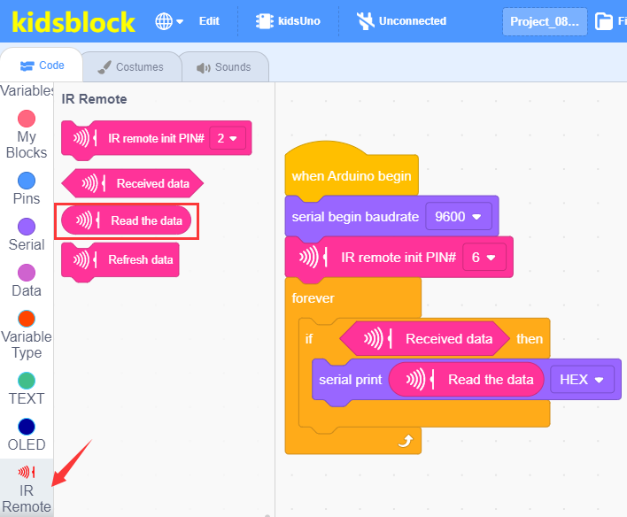

Drag the instruction blockin the **IR Remote** module to the script area.

⑦ Drag the instruction block in the **Control** module to the script area and change the number 1 to 0.05.
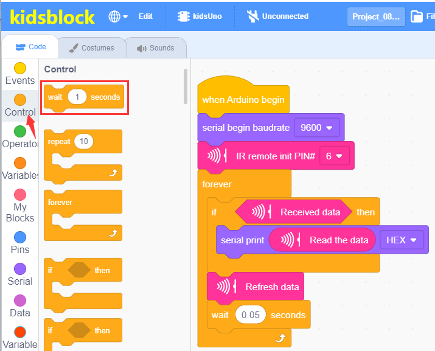

⑧ Complete Program

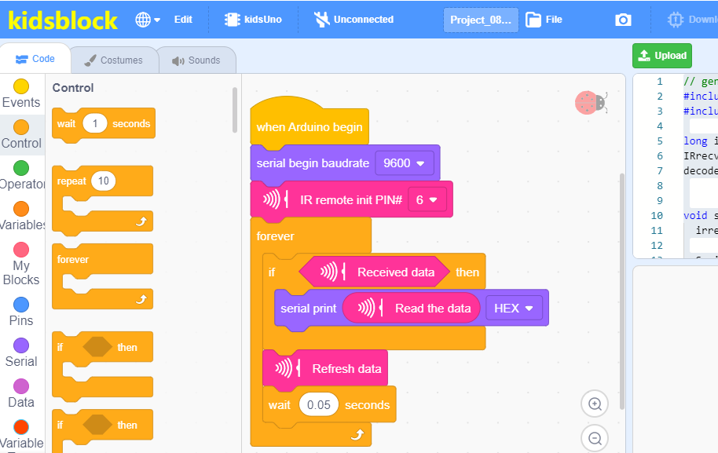

##### Step3：Test Result
Clickto upload the complete program to the kidsuno mainboard and power up, pull out the transparent sheet at the bottom of the IR remote control, then pull out the button slot, and then put in the battery(“**+**”pole is downward )and insert into the slot.

 Battery type：CR2025（provided by yourself）.

Then  click  in the serial monitor area to set the baud rate to 9600. Point the IR remote control to the IR receiver module, press a button on the IR remote control, and you will see a coded value in the serial monitor. Press the same key multiple times to make sure the value is correct. If you see FFFFFFFF, ignore it.

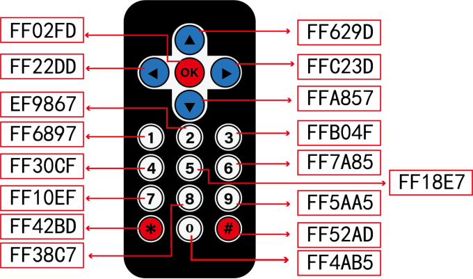

### 6. IR Remote Controls Large Crane
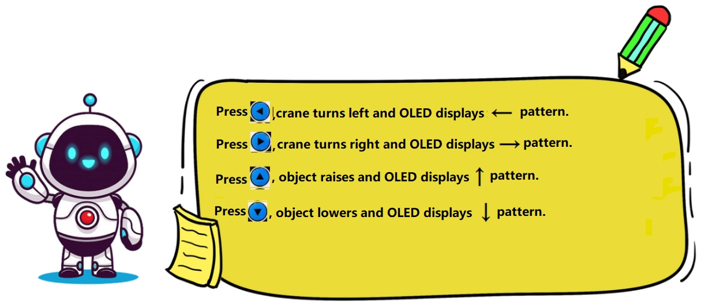

### 7. Programming Steps

##### Step1: Flow Chart

|Setting|set 360° servo to 90°，270° servo rotates from 0° to180°（object raises）and OLED displays “”pattern|
| :--: | :--: |

|  | Value：FF22DD | State |Crane turns left and OLED displays “←” pattern|
| :--: | :--: | :--: | :--: |
|| Value：FFC23D | State |Crane turns right and OLED displays “→” pattern|
| | Value：FF629D |State |Object raises and OLED displays“↑” pattern|
| |Value：FFA8573 |State |Object lowers and OLED displays “↓” pattern|

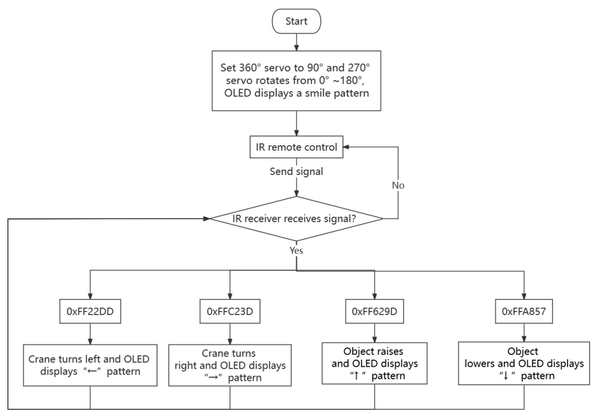

##### Step3：Add **Servo **

##### 

##### Step4：Write the Program

①  Find building blocks
（1）
 
（2）
 
（3）
 
（4）
 
（5）
 
（6）
 
（7）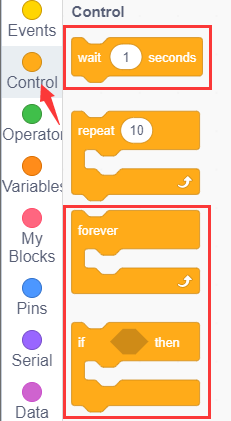
 
（8）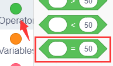
 
（8）
 

② Complete Program

##### Step5：Test Result
Clickto upload the complete program to the kidsuno mainboard and power up, the object raises and OLED displays“” pattern. Press , crane turns left and OLED displays “←” pattern, press , crane turns right and OLED displays “→” pattern, press , object raises and OLED displays“↑” pattern, press , object lowers and OLED displays “↓” pattern.

