# Project 01: Seesaw

## 1. Overview
It is well known that seesaw is sought-after among children. Usually, two children sit on both ends of the seesaw and step on the ground in turn to make one end rise and the other fall. However, in this project, we will work to make a seesaw that can rise and fall automatically.

## 2. Components
|||||
| :--: | :--: | :--: | :--: | 
|Kidsuno Mainboard×1|360°Servo×1|USB Cable×1| Lego Series×1 |

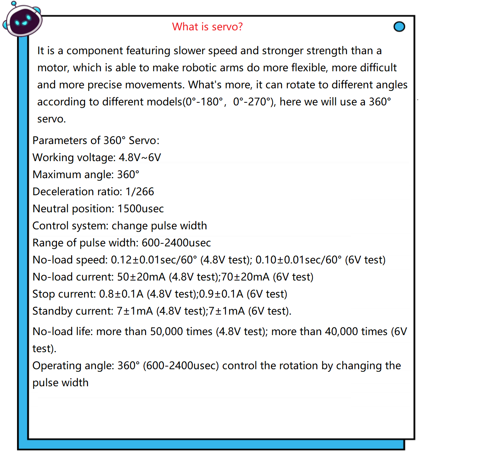

## 3. Make A Seesaw

## 4. Installation 
Please refer to the following link：https://www.dropbox.com/scl/fo/dtu6zv41pd82c71yb65q8/h?rlkey=kzegu8g8jkjieaeqfjxif6kii&dl=0

## 5. Programming Steps

#### Step1：Wiring Diagram
Connect the kidsuno mainboard and computer via a USB cable, and connect the 360° servo to the G, V and D13 interface of the mainboard. The brown wire is connected to G, the red wire is connected to V and the orange wire is connected to D13.
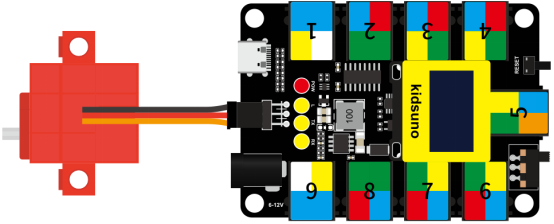

#### Step2：Add Servo

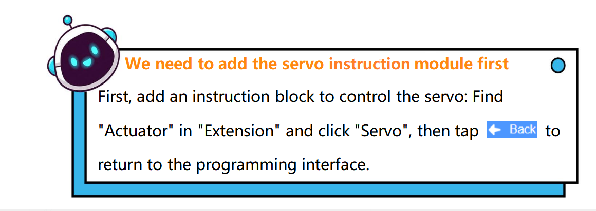

Diagram of the **Extension** Instruction Block

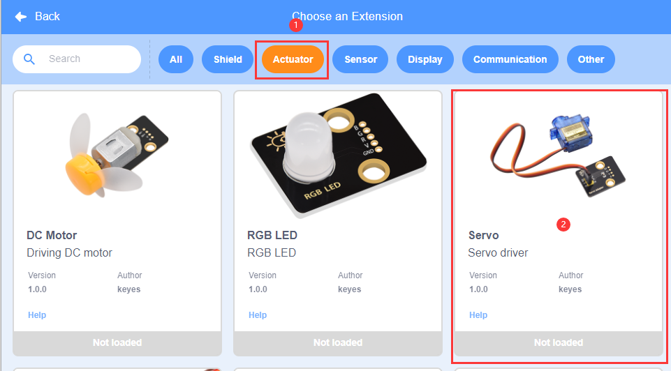
Add **Servo **Instruction Block 

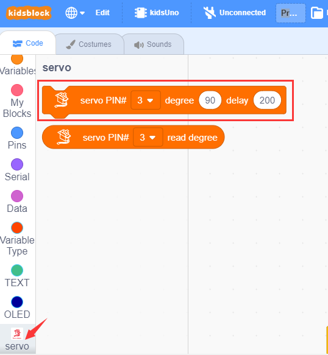

#### Step3: Description of Building Blocks

Set the angle value and delay to the specified pin. When the angle value is 90, the servo will stop rotating; if it is 0 ~ 90, the servo will rotate clockwise, the smaller the value, the faster the rotation speed;  if it is 90 ~ 180, the servo will rotate counterclockwise, the larger the value, the faster the rotation speed.

 Rotation of 180° Servo and 360° Servo ：
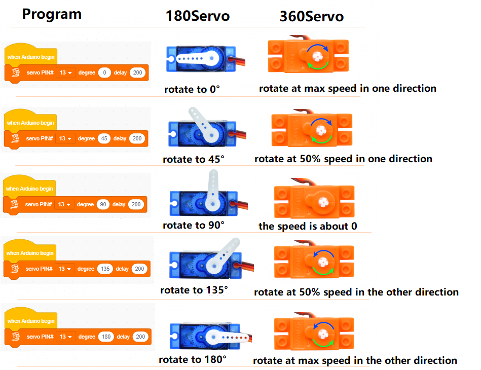

#### Step4：Write the Program
① Drag the instruction block in the **Events** module to the script area.

② Drag the instruction blockin the **Servo** module to the script area. Since the servo is connected to the G, V and D13 interface of the mainboard(The brown wire is connected to G, the red wire is connected to V and the orange wire is connected to D13), then change the number 3 to 13 and angle to any value within the range of 0 ~ 90 or 90 ~ 180. To make the servo rotate slowly, the angle value entered here is 60.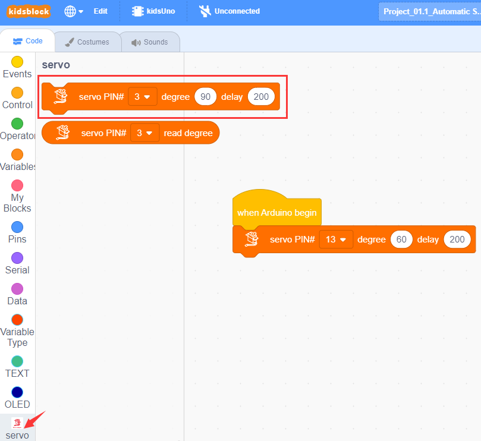

④ Complete Program
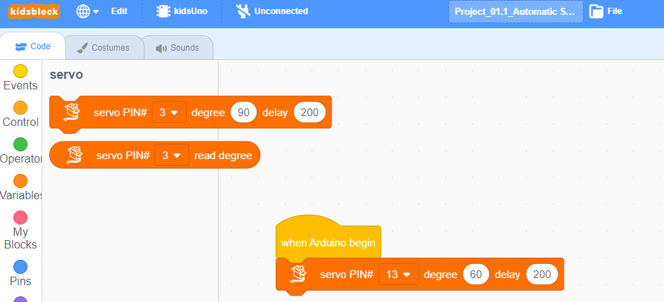

#### Step5：Test Result
Clickto upload the complete program to the kidsuno mainboard and power up, then the seesaw can rise and fall automatically.

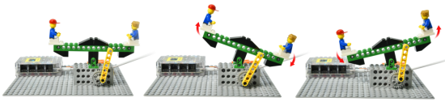

## 6. Expansion Project
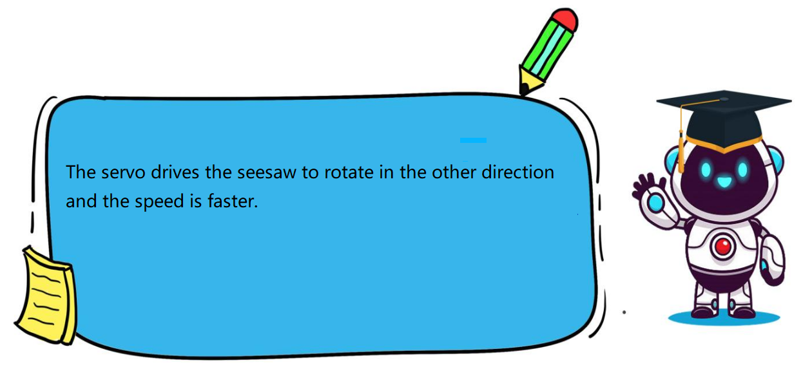

The sample code is below：
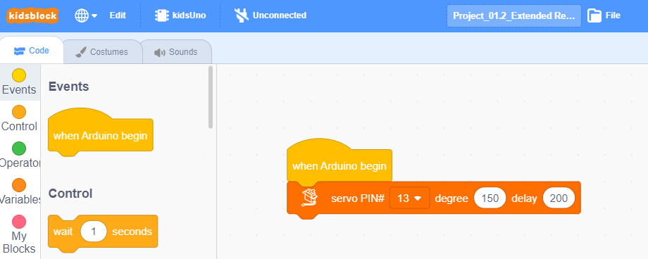

