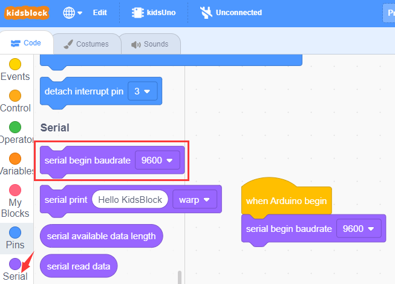
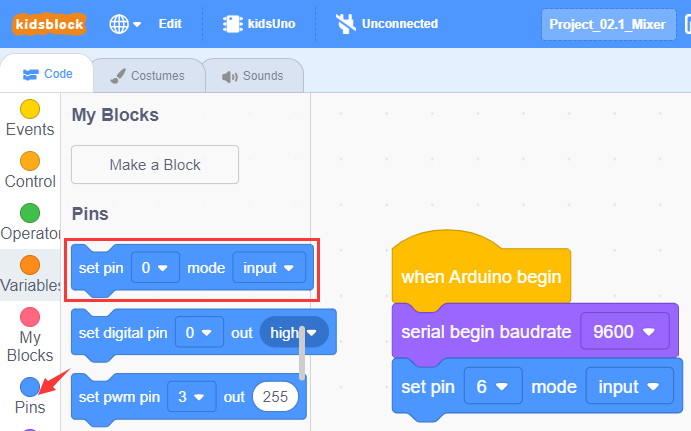
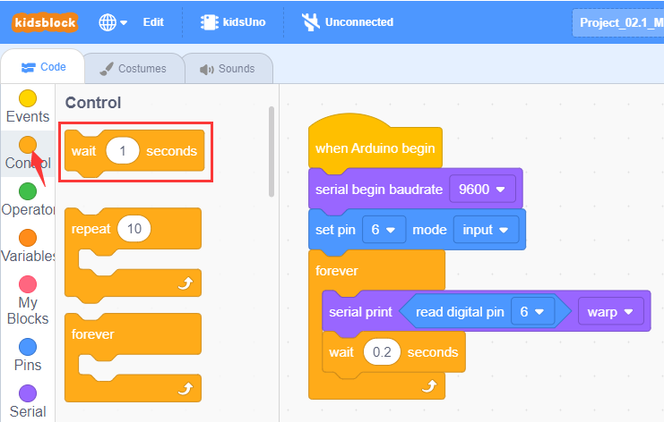
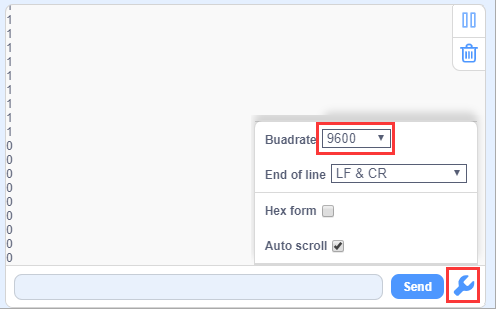

# Project 02: Mixer

## 1. Overview

Mixer is a kind of construction engineering machinery, which is mainly used for mixing some building materials such as cement, sand and gravel. In this project, we will seek to design a mixer.

## 2. Components
||||
| :--: | :--: | :--: |
|Kidsuno Mainboard×1|Digital Capacitive Touch Sensor×1|360°Servo×1|
||||
|Connection Wire×1|USB Cable×1| Lego Series×1 |

## 3. Installation 
Please refer to the following link：https://www.dropbox.com/scl/fo/dtu6zv41pd82c71yb65q8/h?rlkey=kzegu8g8jkjieaeqfjxif6kii&dl=0

## 4. Read the Value of Digital Capacitive Touch Sensor

## 5. Programming Steps

#### Step 1：Wiring Diagram
Connect the kidsuno mainboard and computer via a USB cable, and connect the digital capacitive touch sensor to the No.2 interface, the 360° servo to the G, V and D13 interface of the mainboard. The brown wire is connected to G, the red wire is connected to V and the orange wire is connected to D13.

#### Step 2: Description of Building Blocks

The block is used to set serial baud rate(generally, the baud rate 9600 is taken as an example)

This block is used to set print mode for the serial port. **warp** means line feed printing, **no-warp** means no line feed printing, **HEX** means hexadecimal printing.

It is used to read the digital signal(0 or 1) of the specified pin

This is a command block used to set "**input**" or "**output**" to the specified pin.  "**input**" means input mode;  "**output**" represents output mode;  "**input-pullup**" means setting input mode for the pin and making the pin become high level (1).

This is a command block used to set "**high**" or "**low**" to the specified pin. "**high**" means high level(1)，LED will light up, "**low**" means low level(0)，LED will light off.

It is a delay module and 1 can be altered.

It is a forever module, it will execute one code forever.

#### Step 3：Write the Program
① Drag the instruction block in the **Events** module to the script area.

② Drag the instruction block in the **Serial** module to the script area and take the baud rate 9600 as an example.

③ Drag the instruction block
in the **Pins** module to the script area. Since the digital capacitive touch sensor is connected to D6 of No.2 interface on the mainboard, then change the number 0 to 6.

④ Drag the instruction block  in the **Control** module to the script area.

⑤Drag the instruction block in the **Serial** module to the script area.

⑥ Drag the instruction block in the **Pins** module to the script area and put it into the block , then change the number 0 to 6.

⑦ Drag the instruction block in the **Control** module to the script area and change the number 1 to 0.2.

⑧ Complete Program

#### Step 4：Test Result
Clickto upload the complete program to the kidsuno mainboard and power up, then  click  in the serial monitor area to set the baud rate to 9600. Then the serial monitor will print the value read by the digital capacitive touch sensor. 

When your finger touches the plum-shaped metal sensing area on the sensor, it will output a high level (1); when released, it will output a low level (0).

## 6. Digital Capacitive Touch Sensor Controls Mixer to Rotate

## 7. Programming Steps

#### Step1: Description of Building Blocks

It is a conditional statement code executing **if-then-else ** function: If the logical judgment statement in  is satisfied, the code statement below **then** is executed, otherwise, the code below **else** is executed.

#### Step2：Flow Chart
Set the 360° servo angle to 90°. When you press (or touch) the metal sensing area on the sensor with your finger, the servo and the mixer will rotate, otherwise they won't rotate.

#### Step3：Add **Servo **Instruction Block 

#### Step4：Write the Program

① Find building blocks
（1）
    
（2）
    
（3）
 
（4）
 
（5）
 
（6）
 

② Complete Program

#### Step5：Test Result
Clickto upload the complete program to the kidsuno mainboard and power up. When you press (or touch) the metal sensing area on the sensor with your finger, the servo and the mixer will rotate, otherwise they won't rotate.

## 10. Expansion Project

The sample code is below：

