# Project 03: Windmill

## 1. Overview
In this project, we are going to make a mini windmill.

## 2. Components
||||
| :--: | :--: | :--: |
|Kidsuno Mainboard×1|Rotary Potentiometer×1|360°Servo×1|
|||| 
|Connection Wire×1|USB Cable×1| Lego Series×1 | 
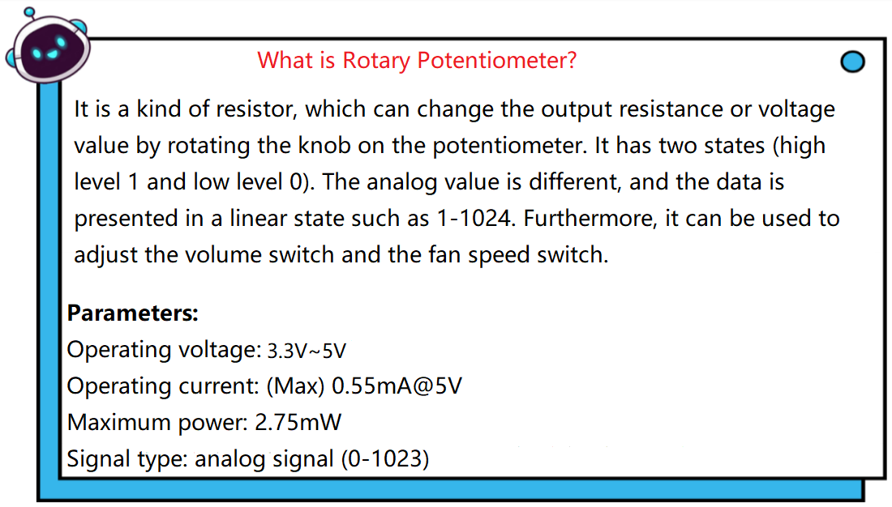

## 3. Installation 
Please refer to the following link：https://www.dropbox.com/scl/fo/dtu6zv41pd82c71yb65q8/h?rlkey=kzegu8g8jkjieaeqfjxif6kii&dl=0

## 4. Read the Value of Rotary Potentiometer

## 5. Programming Steps

#### Step 1：Wiring Diagram

Connect the kidsuno mainboard and computer via a USB cable, and connect the rotary potentiometer to the No.7 interface, the 360° servo to the G, V and D13 interface of the mainboard. The brown wire is connected to G, the red wire is connected to V and the orange wire is connected to D13.
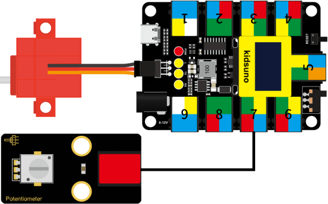

#### Step 2: Description of Building Blocks

This block is used to read analog value of the specified pin (range: 0~1023).

#### Step 3：Write the Program
① Drag the instruction block in the **Events** module to the script area.

② Drag the instruction block in the **Serial** module to the script area and take the baud rate 9600 as an example.

③ Drag the instruction block
in the **Pins** module to the script area. Since the rotary potentiometer is connected to A0 of No.7 interface on the mainboard, then change the number 0 to A0.
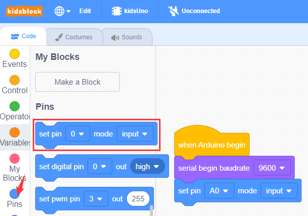

④ Drag the instruction block  in the **Control** module to the script area.
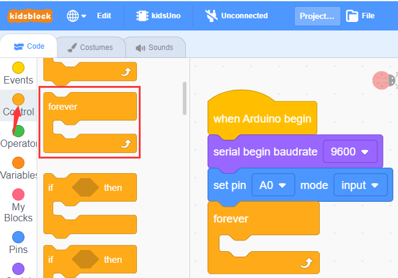

⑤ Drag the instruction block in the **Serial** module to the script area.
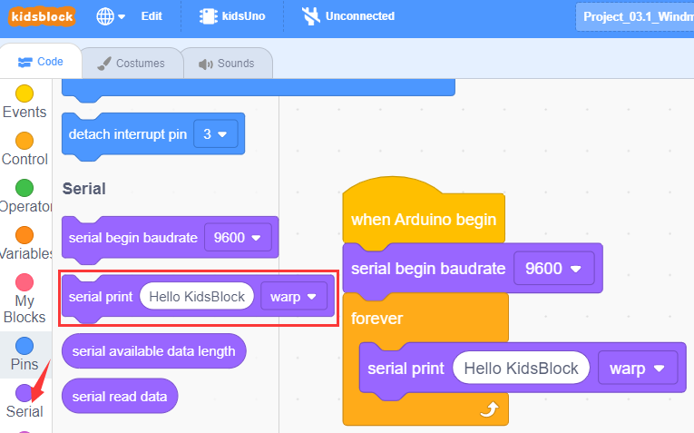

⑥ Drag the instruction block in the **Pins** module to the script area and put it into the block .
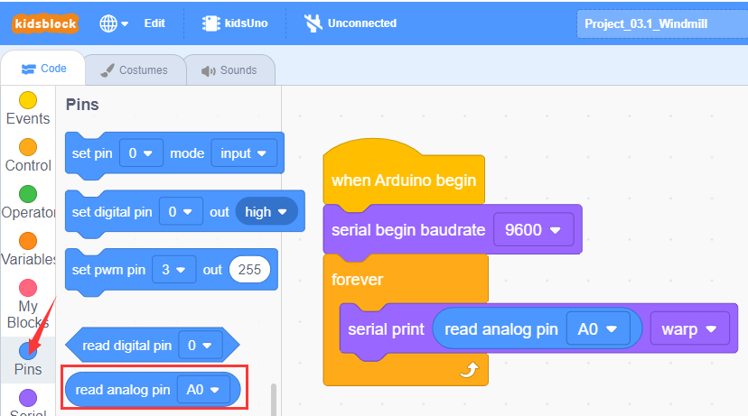

⑦ Drag the instruction block in the **Control** module to the script area and change the number 1 to 0.3.
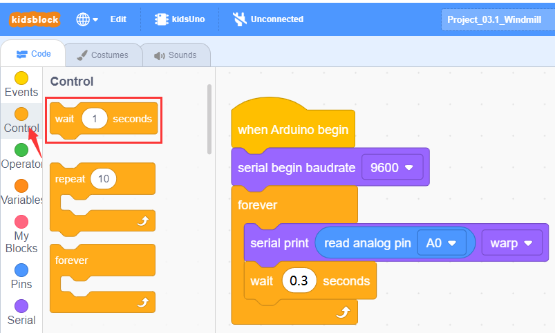

⑧ Complete Program
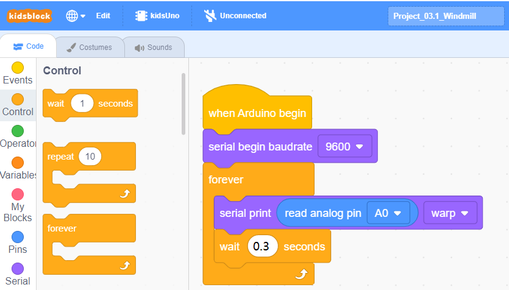

#### Step 4：Test Result
Clickto upload the complete program to the kidsuno mainboard and power up, then  click  in the serial monitor area to set the baud rate to 9600. Then the serial monitor will print the value read by the rotary potentiometer. When the knob on the potentiometer is rotated in one direction, the analog value will gradually increase; otherwise, it will decrease.
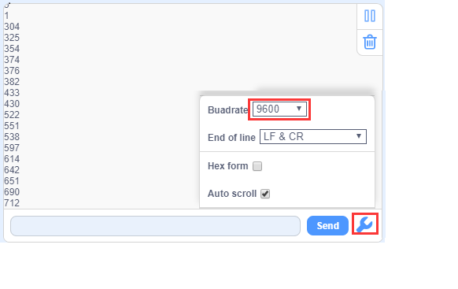

## 6. Rotary Potentiometer Controls Windmill to Rotate
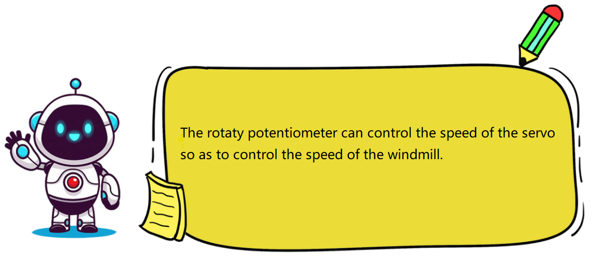

## 7. Programming Steps

#### Step1: Description of Building Blocks

This block is a mapping block, and mapping is a way of mapping each element (called a "key") in one data set to a unique element (called a "value") in another set. This correspondence can be represented in the form of a key-value pair, where each key corresponds to a value.

For example: how does the analog value of the rotary potentiometer correspond to the rotation angle of the 360° servo?
Here you need to use "mapping module" to map the analog value (0 ~ 1023) to the rotation angle of the 360° servo (90 °~180°). After mapping, when the analog value is 0, the angle of the servo is 90°(won't rotate), and when the analog value is 1023, the angle of the servo is 180° ( the servo speed is maximum), as shown below.
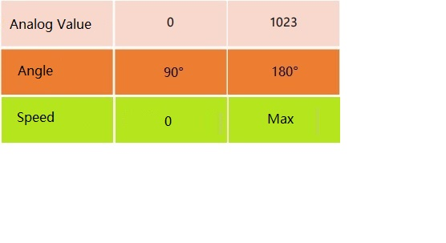

#### Step2：Flow Chart
Set the 360° servo angle to 90°. When the knob on the potentiometer is rotated, the analog value of the potentiometer is mapped to the angle of the servo to control its speed.
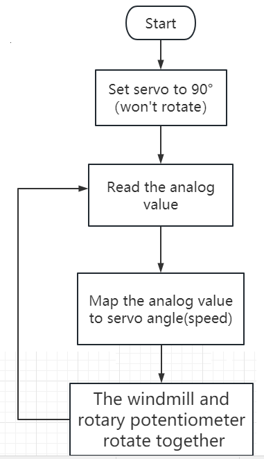

#### Step3：Add **Servo **Instruction Block 

#### Step4：Write the Program
①  Find building blocks
（1）
          
（2）
 
（3）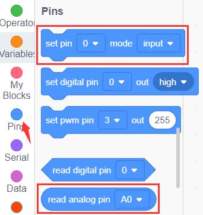
 
（4）
 
（5）
 
（6）
 

② Complete Program
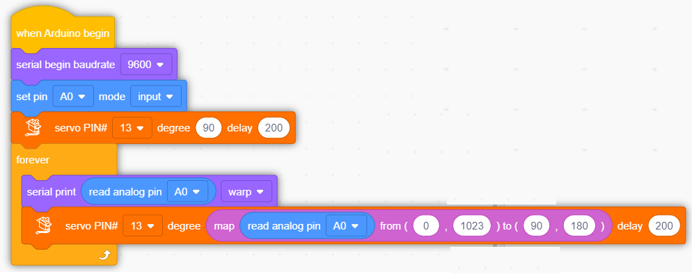

#### Step5：Test Result
Clickto upload the complete program to the kidsuno mainboard and power up, then rotate the knob on the potentiometer by hand, and the speed of the windmill will gradually increase.

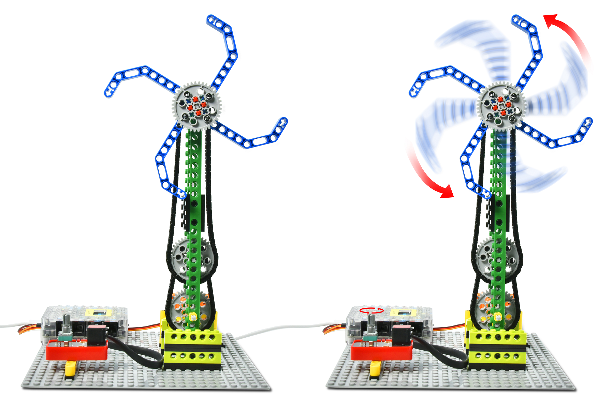

## 8. Expansion Project
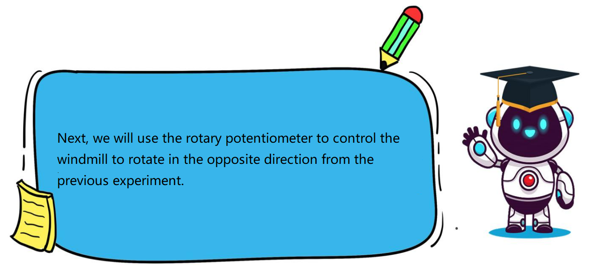

The sample code is below：

