# Project 04: Ferris Wheel

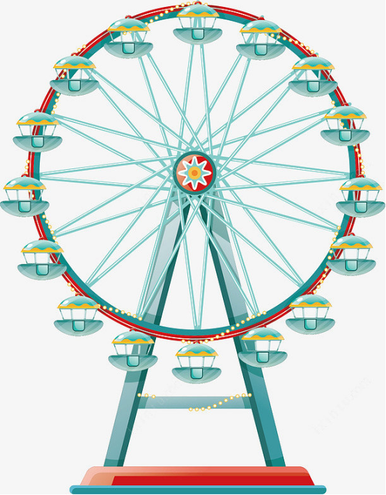

## 1. Overview

When it comes to the Ferris wheel, we must be familiar with it. Sitting on the Ferris wheel, we are able to overlook the surrounding scenery from a height. Thus, in this project, we will work to make a Ferris wheel that can be viewed in the rain.

## 2. Components
|||||
| :--: | :--: | :--: | :--: |
|Kidsuno Mainboard|Steam Sensor×1|Passive Buzzer×1|360°Servo×1|
|||| |
|Connection Wire×2|USB  Cable×1| Lego Series×1 | |
|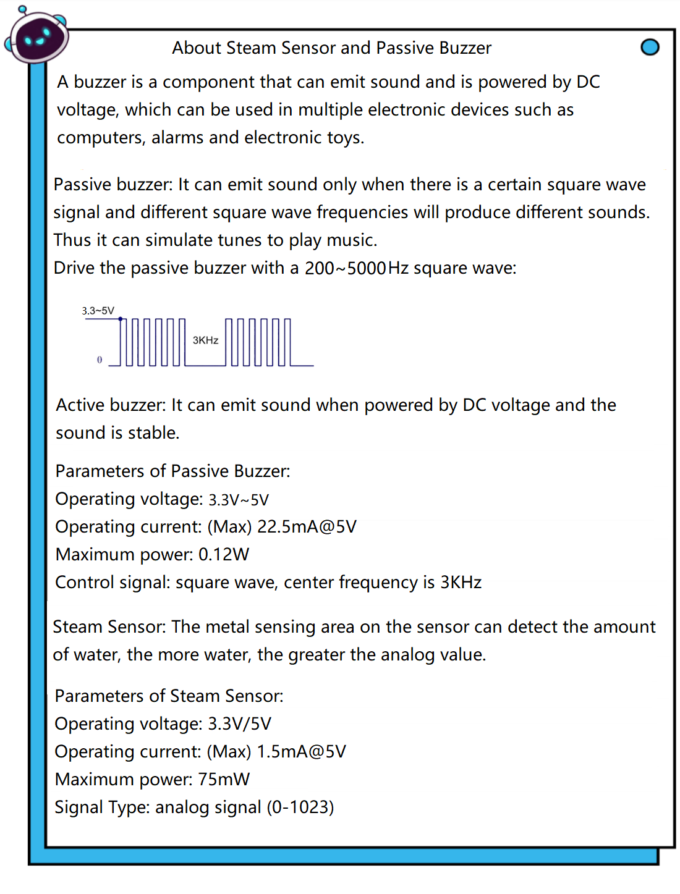||||

## 3. Installation 

Please refer to the following link：https://www.dropbox.com/scl/fo/dtu6zv41pd82c71yb65q8/h?rlkey=kzegu8g8jkjieaeqfjxif6kii&dl=0

## 4. Play Music

## 5. Programming Steps

#### Step1：Wiring Diagram

Connect the kidsuno mainboard and computer via a USB cable, and connect the steam sensor to No.7 interface, passive buzzer to No.6 interface and the 360° servo to the G, V and D13 interface of the mainboard. The brown wire is connected to G, the red wire is connected to V and the orange wire is connected to D13.
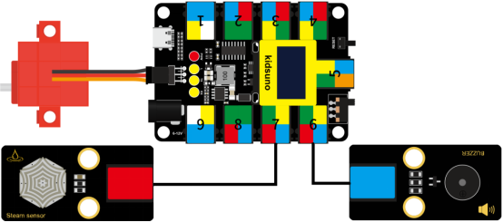

#### Step2: Write《Twinkle, twinkle, little star!》
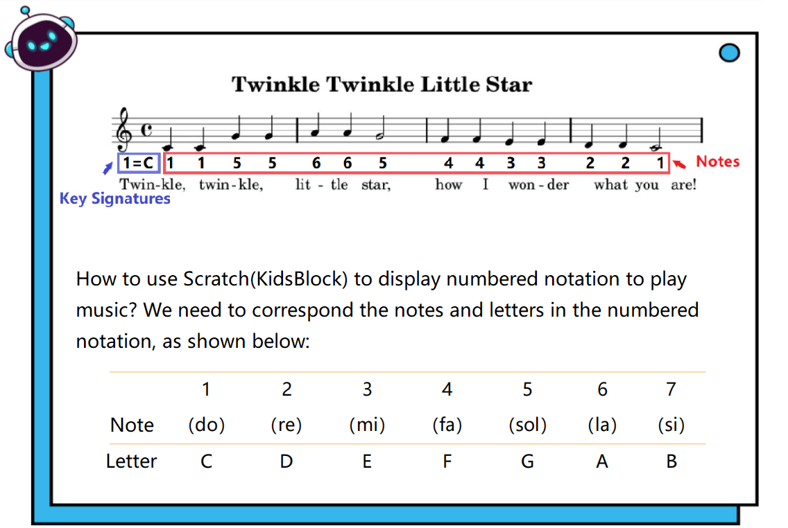

#### Step3：Add Passive Buzzer Command Module
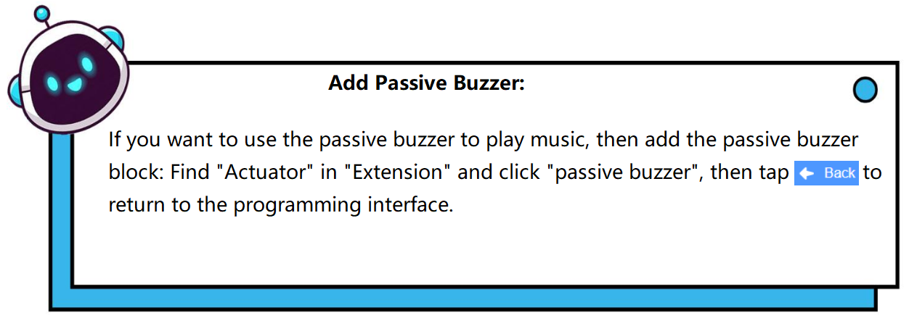

Diagram of the **Extension** Instruction Block

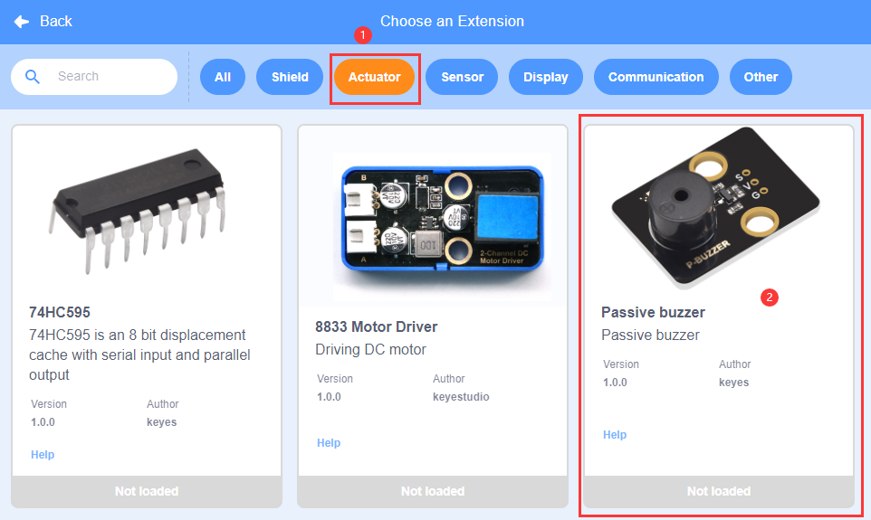
Add “**Passive Buzzer**” Instruction Block

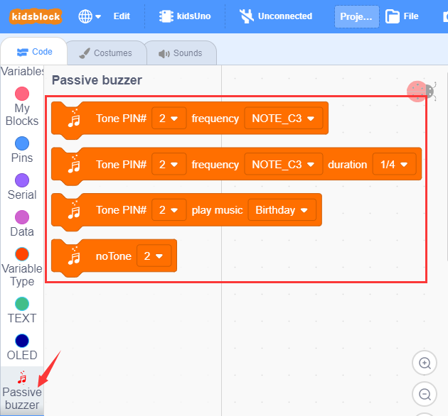

#### Step4: Description of Building Blocks

Set the play frequency of the passive buzzer to the specified pin.

Set the play frequency and beat of the passive buzzer to the specified pin.

Set the passive buzzer to play specific music to the specified pin.

Set the passive buzzer to the specified pin without sound.

#### Step 5：Write the Program
① Drag the instruction block in the **Events** module to the script area.

② Drag the instruction blockin the **Passive Buzzer** module to the script area. Since the interface of the passive buzzer module is connected to the D4 pin of the No. 6 interface on the mainboard, change the number 2 to number 4. This module can play different notes via the parameter "NOTE_C4", and the parameter "1/4" can be used to adjust beat. (C4 refers to playing in the midrange state, where 4 represents the pitch of the note, and it can also be replaced by D4, G4 and A4 )
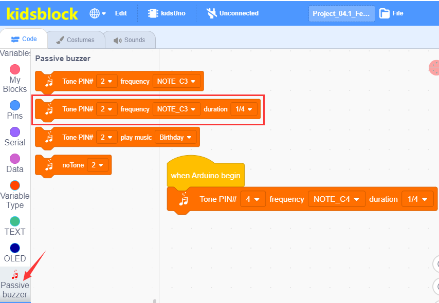

③ Duplicate13 times, then change NOTE_C4 and 1/4, as shown below:
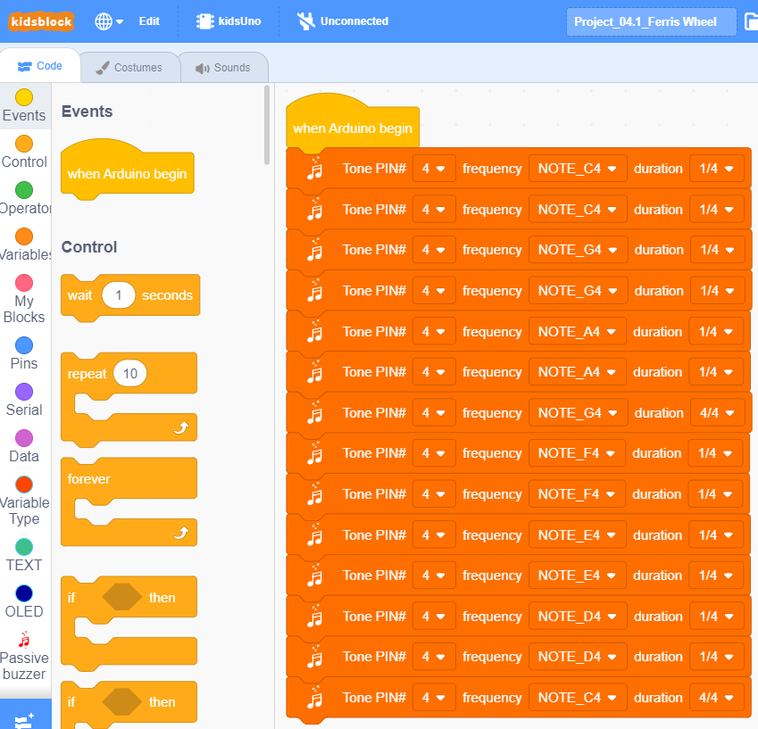

④Drag the instruction blockin the **Passive Buzzer** module to the script area, then change the number 2 to number 4.
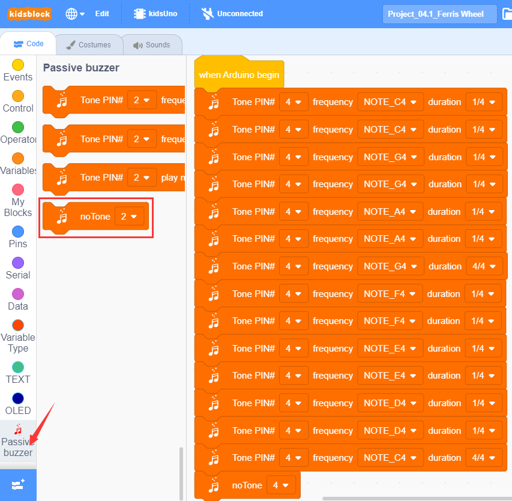

⑤ Complete Program
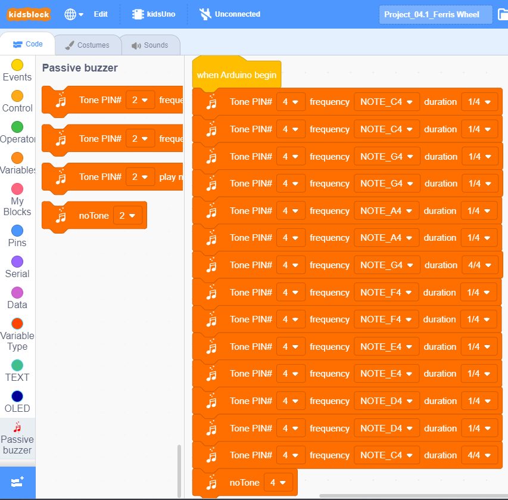

#### Step 6：Test Result
Clickto upload the complete program to the kidsuno mainboard and power up, then passive buzzer will play music.

## 6. Steam Sensor Detects Water
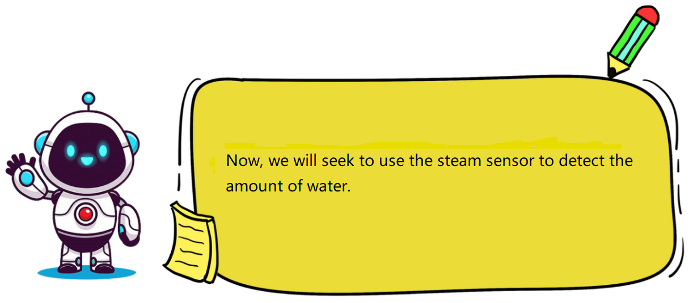

## 7. Programming Steps

#### Step1: Write the Program

① Drag the instruction block in the **Events** module to the script area.

② Drag the instruction block in the **Serial** module to the script area and take the baud rate 9600 as an example.

③ Drag the instruction block
in the **Pins** module to the script area. Since the steam sensor is connected to A0 of No.7 interface on the mainboard, then change the number 0 to A0 .

④ Drag the instruction block  )in the **Control** module to the script area.

⑤ Drag the instruction block in the **Serial** module to the script area.

⑥ Drag the instruction block in the **Pins** module to the script area and put it into the block .

⑦ Drag the instruction block in the **Control** module to the script area and change the number 1 to 0.3.

⑧ Complete Program

#### Step2：Test Result
Clickto upload the complete program to the kidsuno mainboard and power up, then  click  in the serial monitor area to set the baud rate to 9600. Then the serial monitor will print the value read by the steam sensor.

Touch the metal detection area on the sensor with a moistened finger, the larger the area, the greater the value!
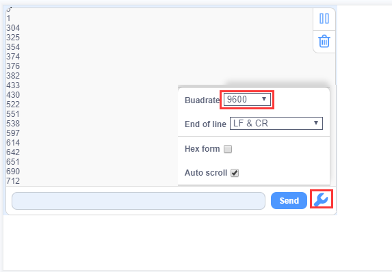

## 8. Steam Sensor Controls Servo and Buzzer
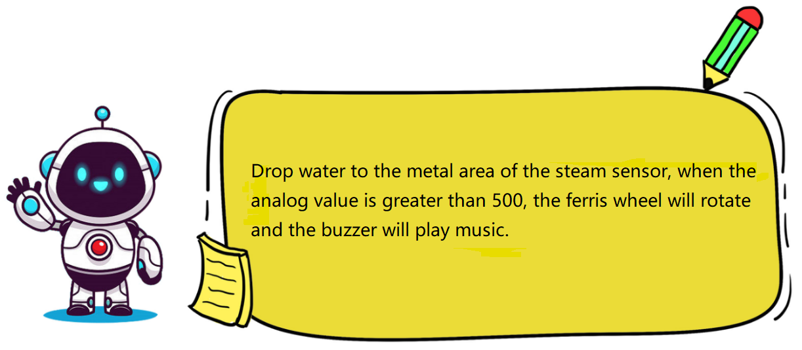

## 9. Programming Steps

#### Step1: Flow Chart

Set the 360° servo angle to 90°, then read the analog value of the steam sensor. When the analog value is greater than 500, the servo and Ferris wheel will rotate, and the buzzer will play music; otherwise, the the servo and Ferris wheel will not rotate, and the buzzer does not sound.

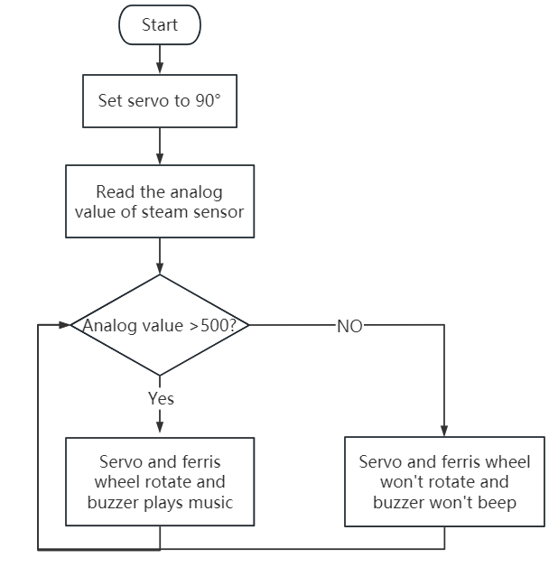

#### Step2：Add **Servo **Instruction Block 

#### Step3：Write the Program
①  Find building blocks

（1）
    
（2）
    
（3）
 
（4）
 
（5）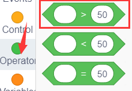
 
（6）
 
（7）
 

② Complete Program
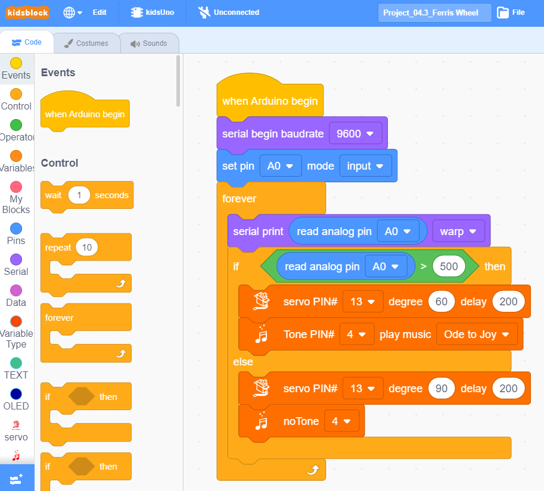

#### Step4：Test Result
Clickto upload the complete program to the kidsuno mainboard and power up, then drop water on the metal detection area of the sensor. When the analog value is greater than 500, the servo and Ferris wheel will rotate, and the buzzer will play music; otherwise, the the servo and Ferris wheel will not rotate, and the buzzer does not sound.

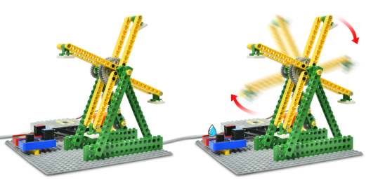

## 10. Expansion Project
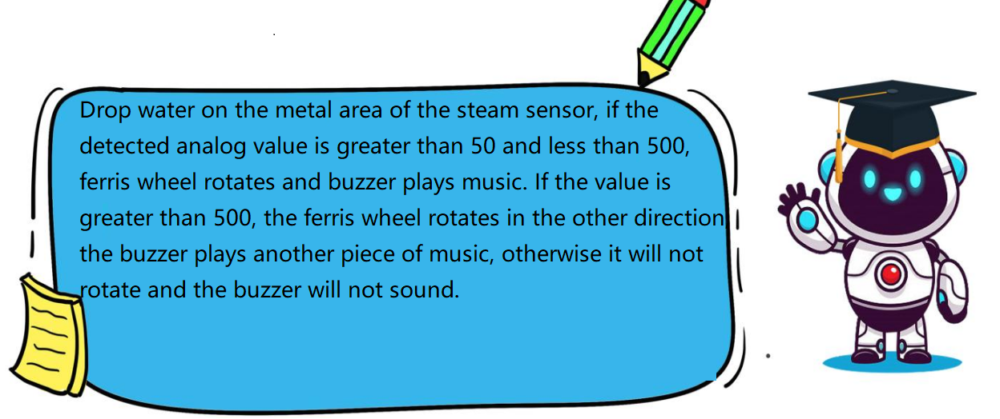

The sample code is below：
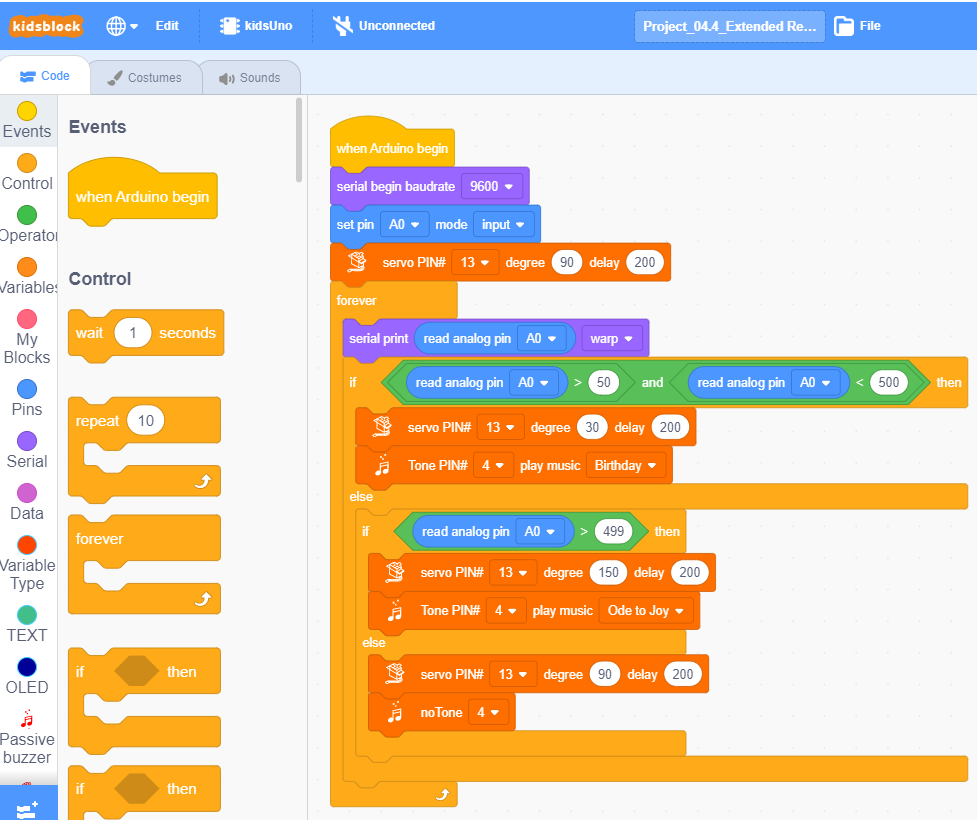

