# Project 05: Rope Skipping Machine

## 1. Overview
Rope skipping machine is used to replace the traditional rope skipping method, which frees our hands. It can not only realize forward and reverse jumps, but also change the speed of skipping ropes according to needs.

## 2. Components
||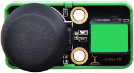|| |
| :--: | :--: | :--: | :--: |
|Kidsuno Mainboard×1|Joystick Module×1|360°Servo×1|Passive Buzzer×1|
||||  |
|Connection Wire×2|USB Cable×1| Lego Series×1 |  |
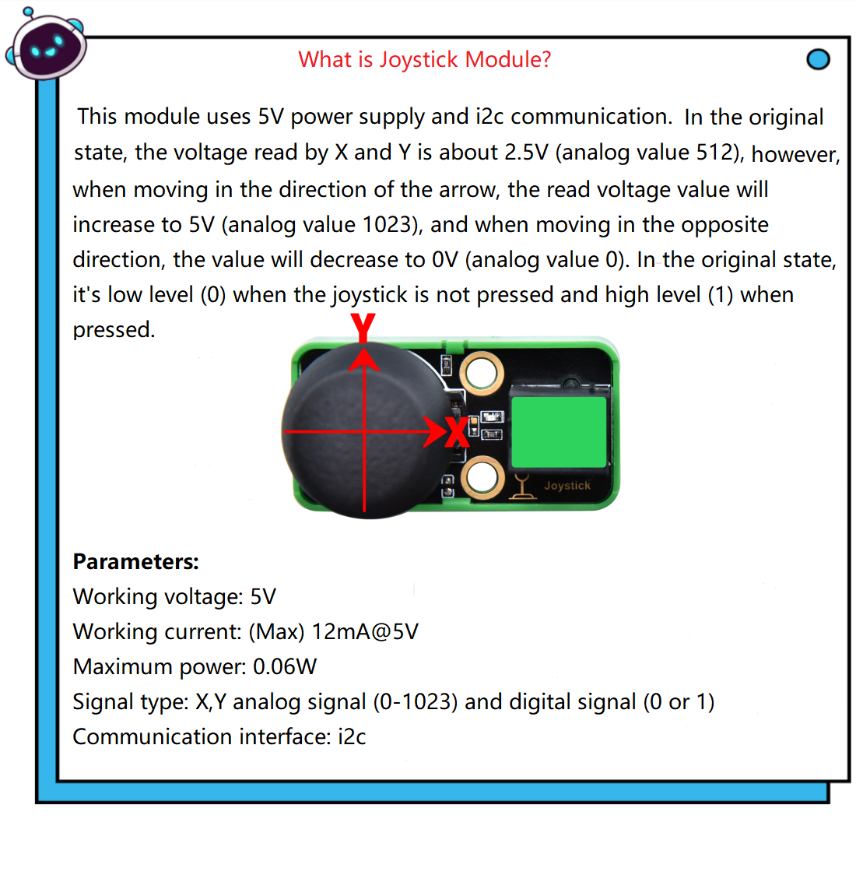

## 3. Installation 

Please refer to the following link：https://www.dropbox.com/scl/fo/dtu6zv41pd82c71yb65q8/h?rlkey=kzegu8g8jkjieaeqfjxif6kii&dl=0

## 4. Read the Value of Joystick Module
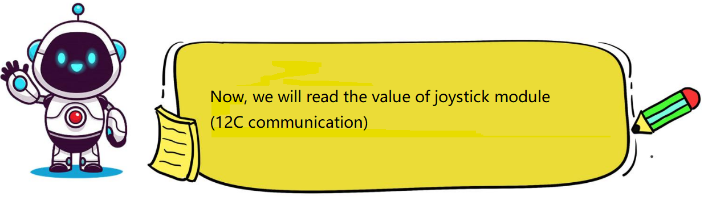

## 5. Programming Steps

#### Step1：Wiring Diagram

Connect the kidsuno mainboard and computer via a USB cable, and connect the joystick module to No.3 interface, passive buzzer to No.2 interface and the 360° servo to the G, V and D13 interface of the mainboard. The brown wire is connected to G, the red wire is connected to V and the orange wire is connected to D13.
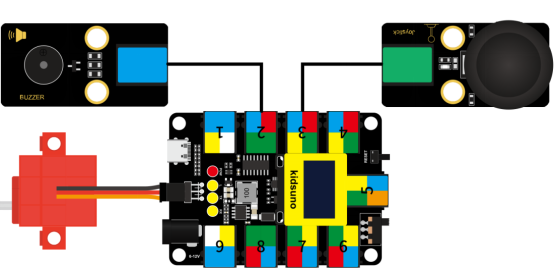

#### Step2：Add Joystick Module 

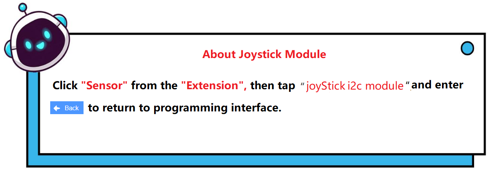

Diagram of the **Extension** Instruction Block

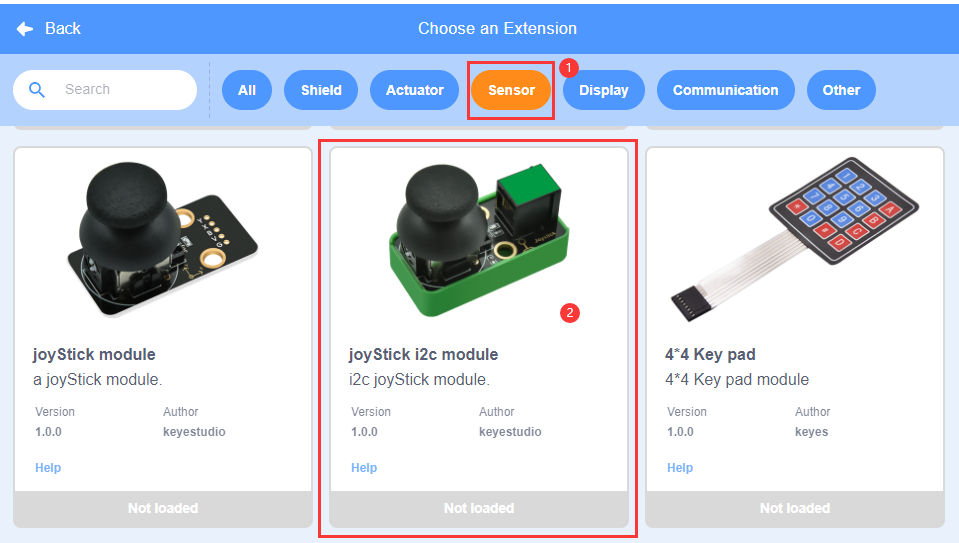
Add “**Joystick Module **” Instruction Block
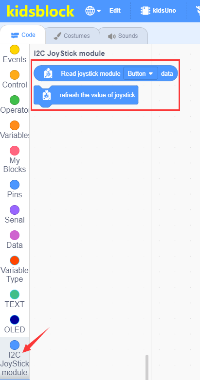

#### Step3: Description of Building Blocks

This block is used to read the analog value of the X-axis of the joystick module (range: 0~1023).

This block is used to read the analog value of the Y-axis of the joystick module (range: 0~1023).

This block is used to read the button value of the joystick module (1/0).

This block is used to refresh the value of the joystick module.

#### Step4：Write the Program
① Drag the instruction block in the **Events** module to the script area.

② Drag the instruction block in the **Serial** module to the script area and take the baud rate 9600 as an example.

③ Drag the instruction block  in the **Control** module to the script area.

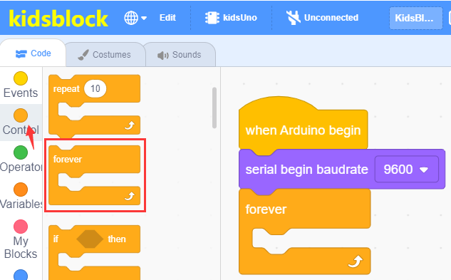

④ Drag the instruction blockin the **I2C Joystick Module ** module to the script area and place it into the block .

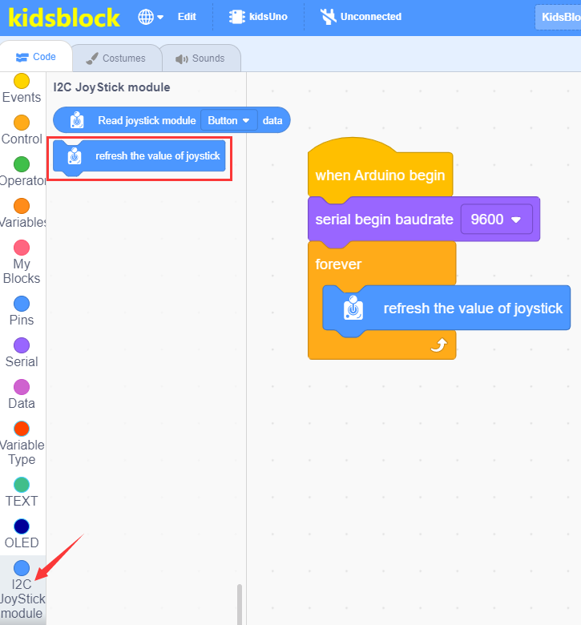

⑤ Drag the instruction block in the **Serial** module to the script area, then change “**Hello KidsBlock**” to “**X:**, **warp** to **no-warp**.
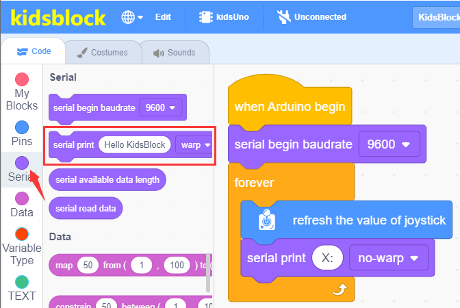

⑥ Drag the instruction block in the **Serial** module to the script area and place it into the block , then change **warp** to **no-warp**.

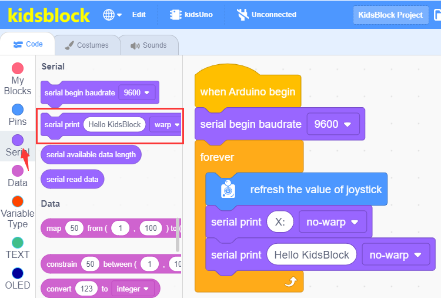

⑦ Drag the instruction blockin the **I2C Joystick Module ** module to the script area and place it into the block , then change “**button” to  X**.

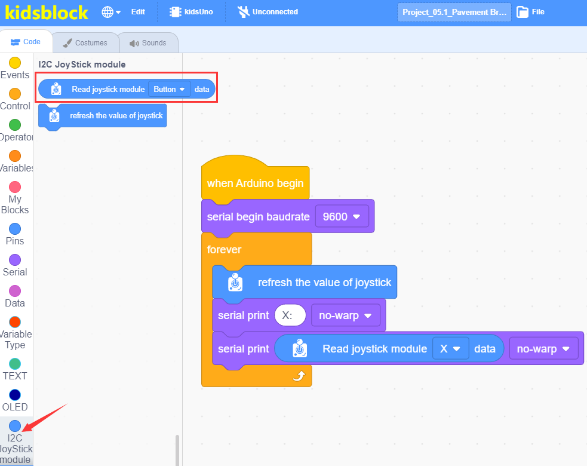

⑧ Copy block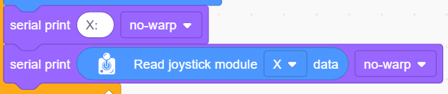twice，then change “**X：** ” to “ **Y：** and “ **btn_val：**”，and change “**X**” to “**Y**” and “**button”**，the  **no-warp**  behind “**Button” **to **warp**.
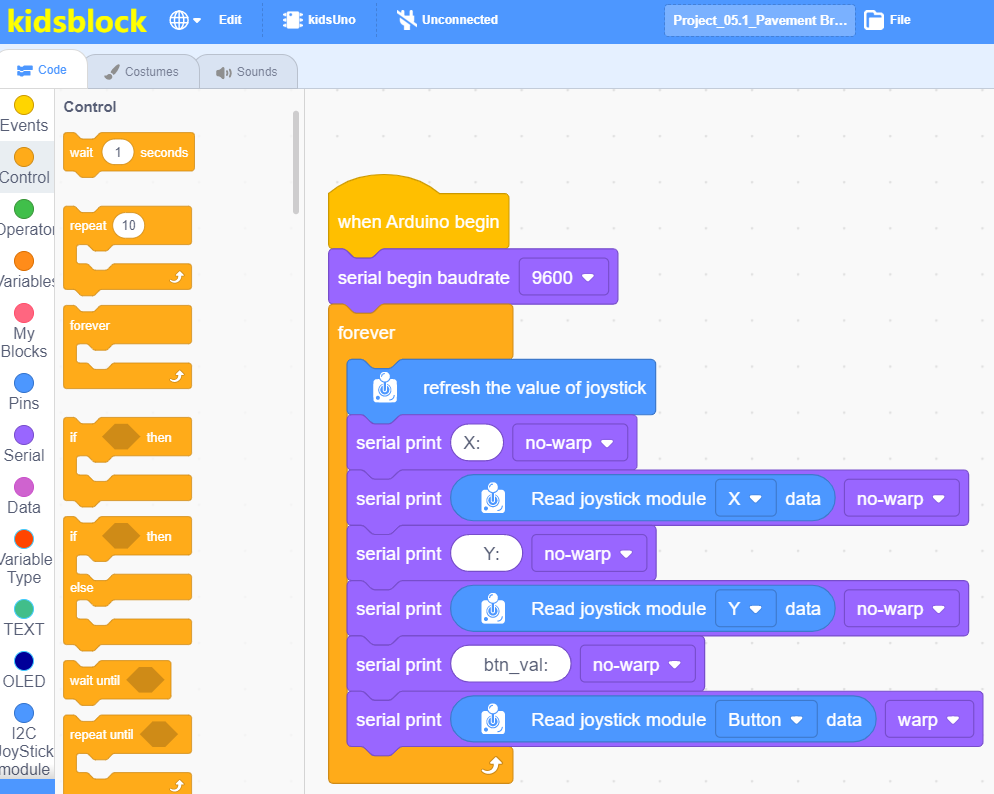

⑨ Drag the instruction block in the **Control** module to the script area and change the number 1 to 0.2.
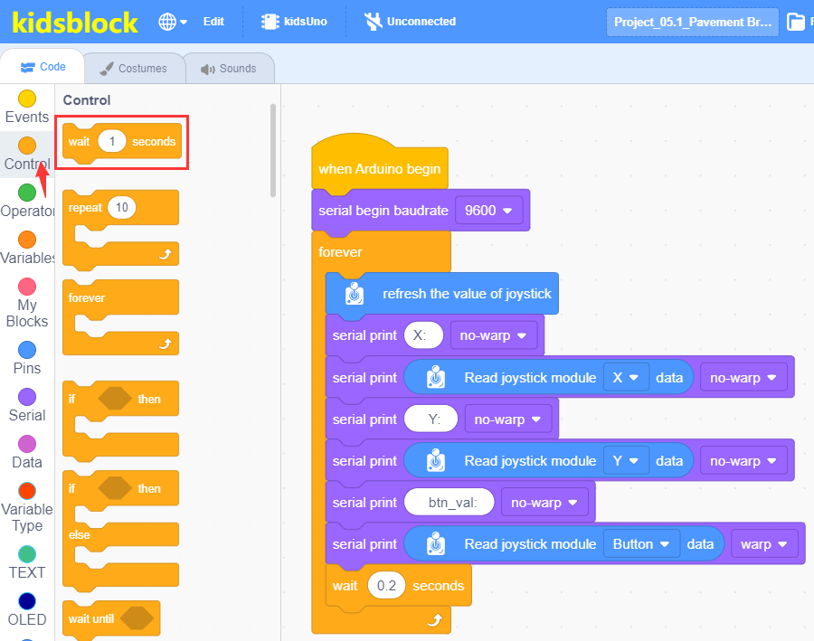

⑩ Complete Program
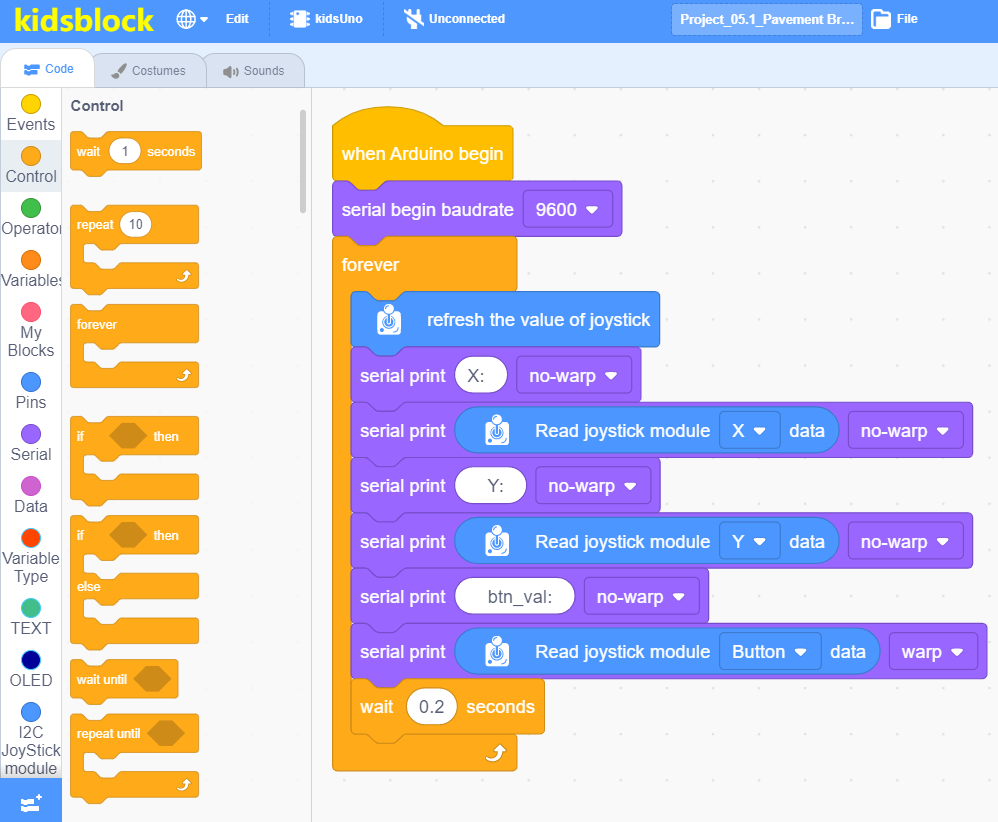

#### Step5：Test Result
Clickto upload the complete program to the kidsuno mainboard and power up,  then  click  in the serial monitor area to set the baud rate to 9600, then the serial monitor will print the analog and digital values read by the joystick module.

In the original state, the read analog values of X and Y are about 512. When moving in the direction of the arrow, the value gradually increases, as the arrow moves in the opposite direction, the value decreases gradually. When the joystick module is not pressed, it is low level (0); when pressed, it is high level (1).
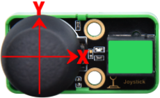
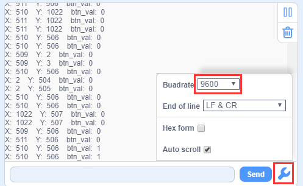

## 6. Joystick Module Controls Rope Skipping Machine
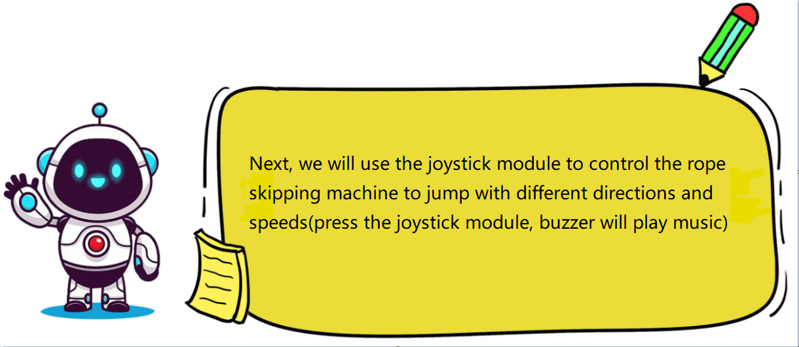

## 7. Programming Steps

#### Step1: Flow Chart

Set the 360° servo angle to 90°(won't rotate), then read values of the joystick module, if the X value is greater than 512, the rope skipping machine jumps from back to front and the speed changes, otherwise it jumps from front to back. Press the joystick module, passive buzzer will play music, otherwise it won't play music.

#### Step2：Add Servo and Passive Buzzer
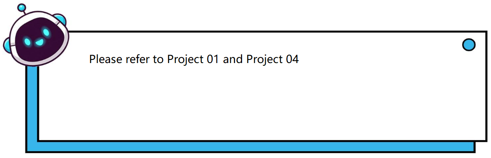

#### Step3：Write the Program

①  Find building blocks
（1）
          
（2）
 
（3）
 
（4）
 
（5）
 
（6）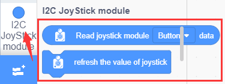
 
（7）
 
（8）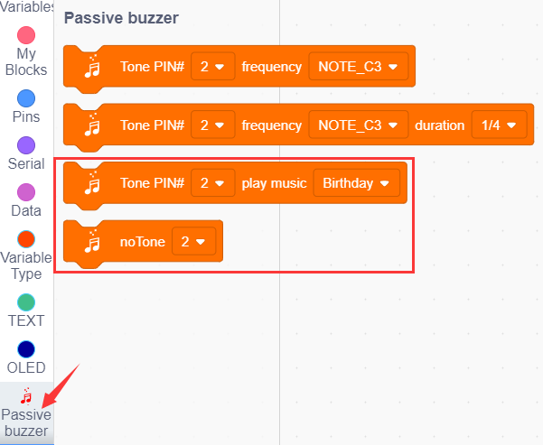
 
② Complete Program

#### Step4：Test Result
Clickto upload the complete program to the kidsuno mainboard and power up, if the X value is greater than 512, the rope skipping machine jumps from back to front and the speed changes, otherwise it jumps from front to back. Press the joystick module, passive buzzer will play music, otherwise it won't play music.

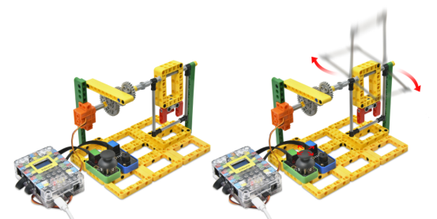

## 8. Expansion Project
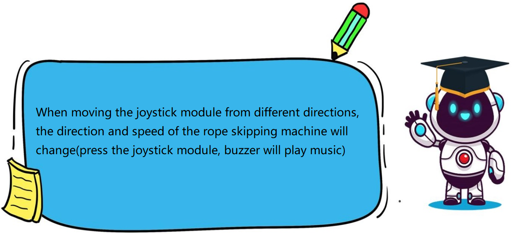

The sample code is below：
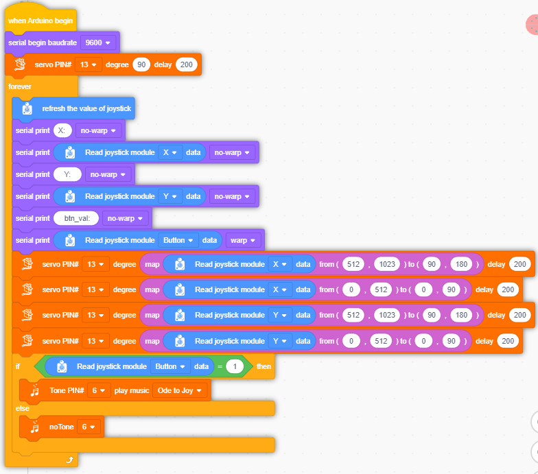

