# Project 06: Breaker

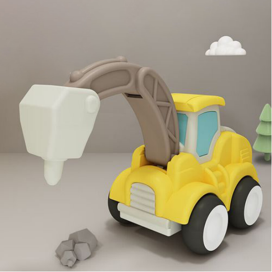

## 1. Overview
Breaker is a machine that can level out uneven pavement. In this project, we will make one together!

## 2. Components
||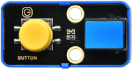||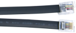|
| :--: | :--: | :--: |:--: |
|Kidsuno Mainboard×1|Button Module×1|270° Servo×1|Connection Wire×1|
|||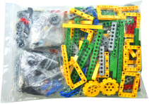| |
|Wheel×4|USB Cable×1| Lego Series×1 | |
|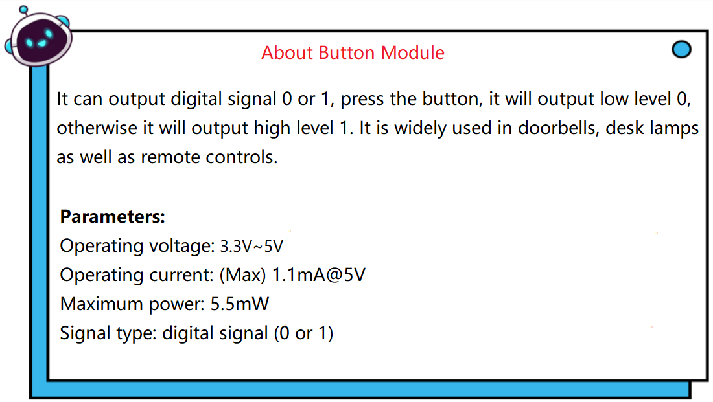|||

## 3. Installation 

Please refer to the following link：https://www.dropbox.com/scl/fo/dtu6zv41pd82c71yb65q8/h?rlkey=kzegu8g8jkjieaeqfjxif6kii&dl=0

## 4. Read the Button Value

## 5. Programming Steps

#### Step1：Wiring Diagram

Connect the kidsuno mainboard and computer via a USB cable, and connect the button module to No.2 interface and the 270° servo to the G, V and D13 interface of the mainboard. The brown wire is connected to G, the red wire is connected to V and the orange wire is connected to D13.
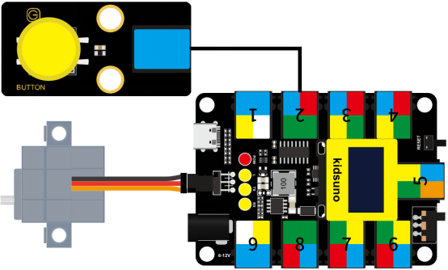

#### Step2: Description of Building Blocks
Please refer to Project 02: Mixer

#### Step3：Write the Program
① Drag the instruction block in the **Events** module to the script area.

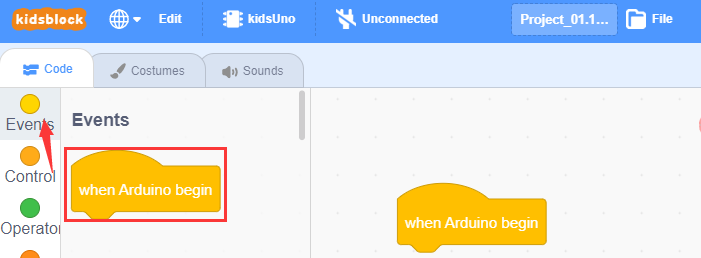

②  Drag the instruction block in the **Serial** module to the script area and take the baud rate 9600 as an example.

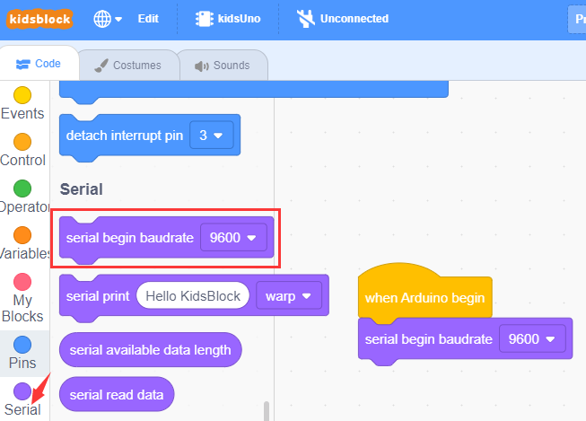

③ Drag the instruction block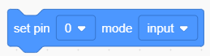
in the **Pins** module to the script area. Since the button module is connected to D6 of No.2 interface on the mainboard, then change the number 0 to 6 .

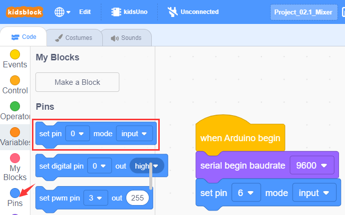

④ Drag the instruction block  in the **Control** module to the script area.

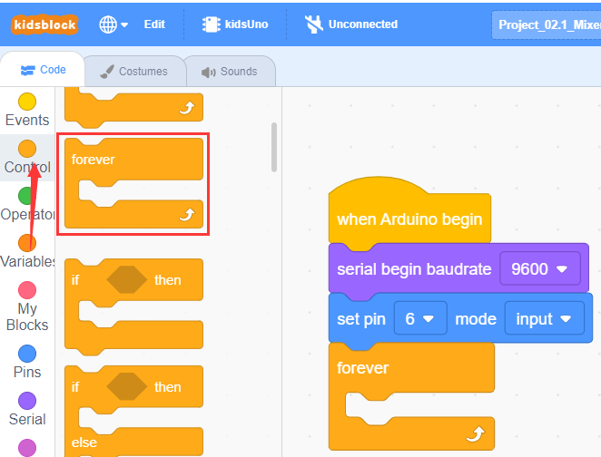

⑤ Drag the instruction block in the **Serial** module to the script area.

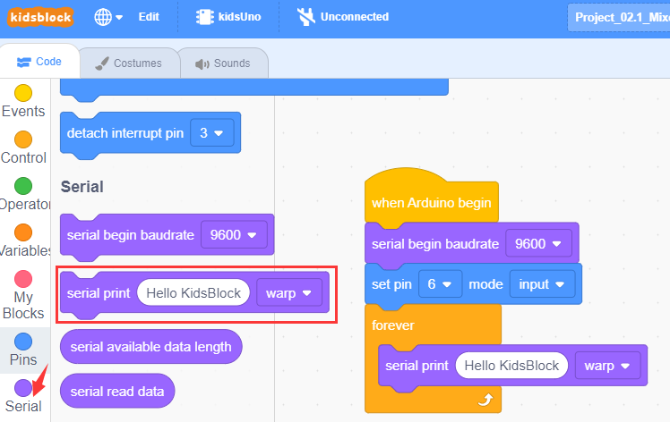

⑥ Drag the instruction block in the **Pins** module to the script area and put it into the block , then change the number 0 to 6.

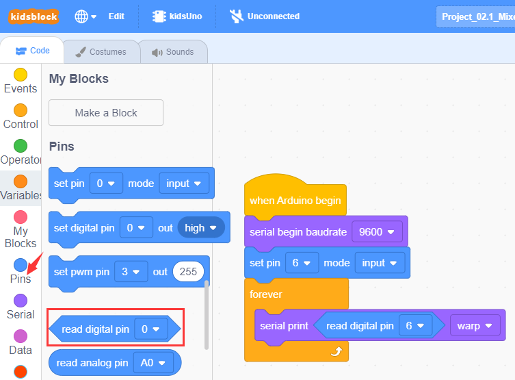

⑦ Drag the instruction block 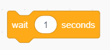in the **Control** module to the script area and change the number 1 to 0.2.

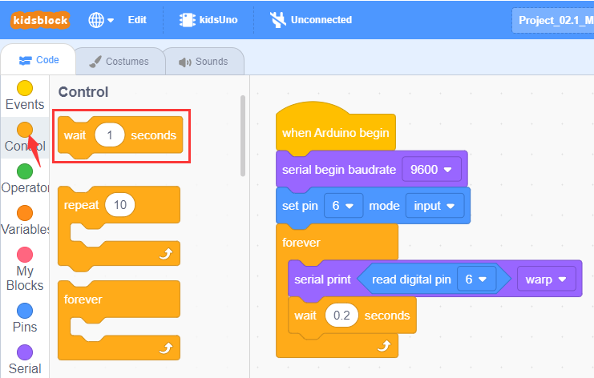

⑧ Complete Program

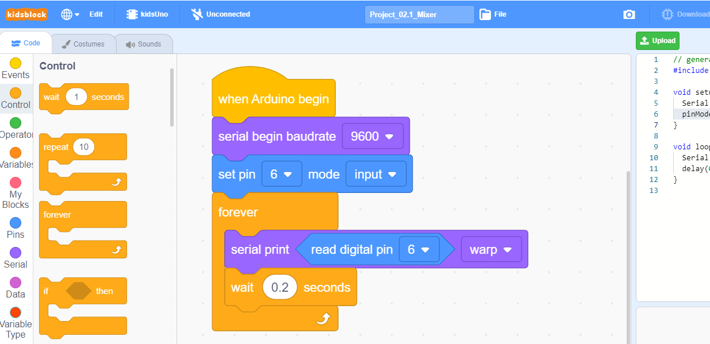

#### Step4：Test Result
Clickto upload the complete program to the kidsuno mainboard and power up, then  click  in the serial monitor area to set the baud rate to 9600. The serial monitor will print the value read by the button module, when you press the button on the module, it will output a low level (0); when you release it, it will output a high level (1).

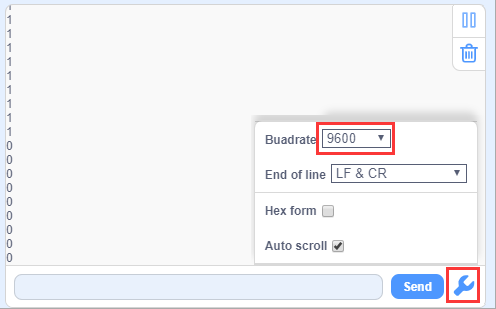

## 6. Button Controls Breaker
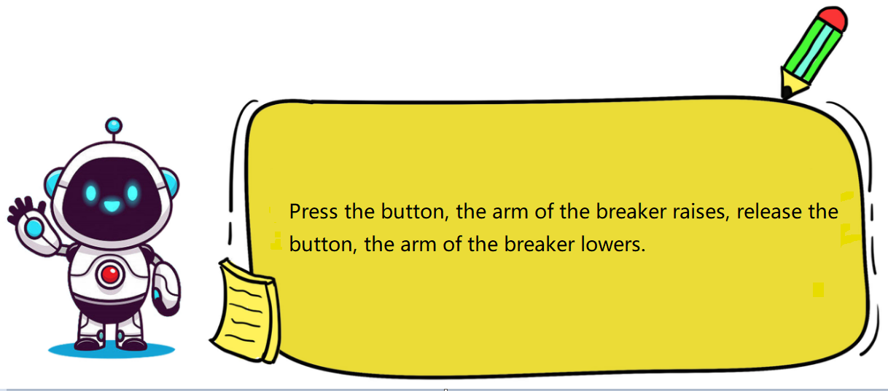

## 7. Programming Steps

#### Step1: Description of Building Blocks

Variable block:
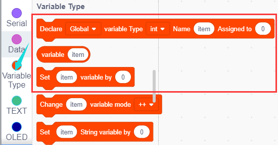

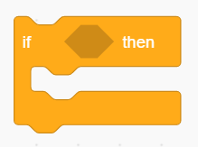
It is a conditional statement code executing **if-then ** function: If the logical judgment statement in  is satisfied, the code statement below **then** is executed.

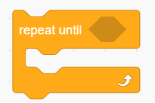
It is a conditional loop statement, it will loop forever if the condition in  is satisfied.

#### Step2: Flow Chart

Set the 270° servo to 95°. When the button on the module is pressed, the long arm of the breaker will be raised; when released, it will be lowered. (press the button and then release it will complete a beat.) 
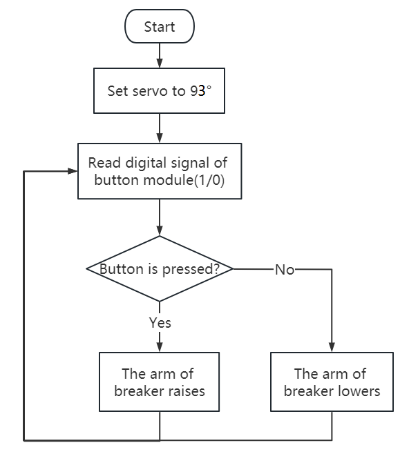

#### Step3：Add **Servo **
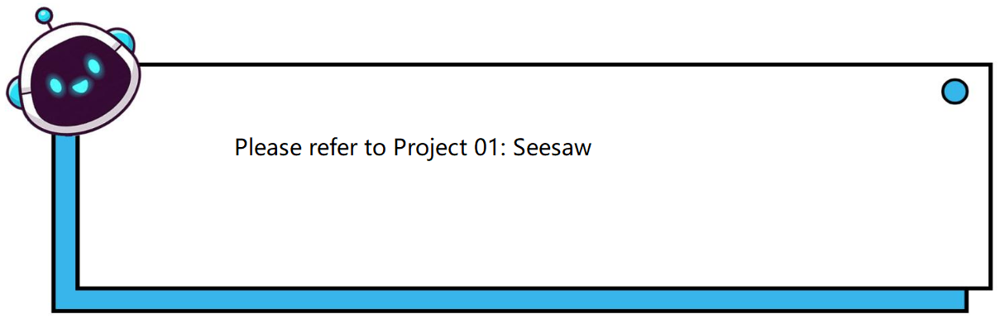

#### Step4：Write the Program
①  Find building blocks
（1）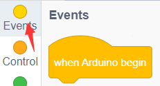
 
（2）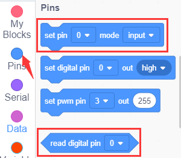
 
（3）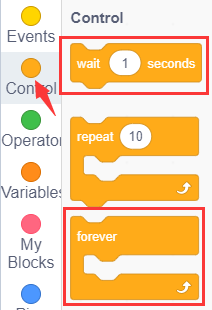
 
（4）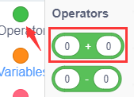
 
（5）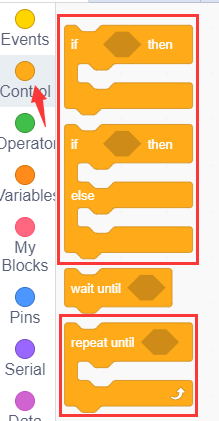
 
（6）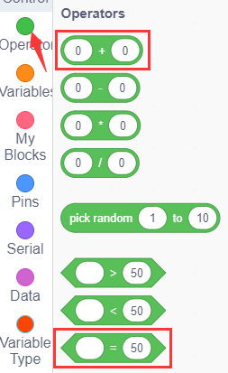
 
（7）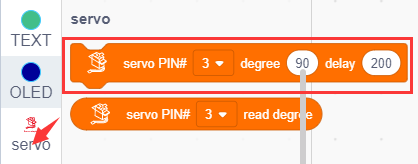
 
（8）
 
② Complete Program

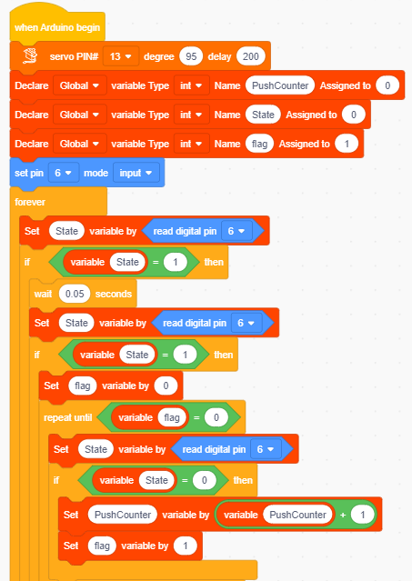
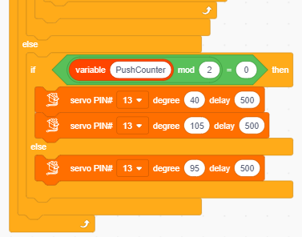

#### Step5：Test Result
Clickto upload the complete program to the kidsuno mainboard and power up. When the button on the module is pressed, the long arm of the breaker will be raised; when released, it will be lowered. (press the button and then release it will complete a beat.) 

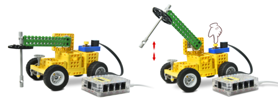

