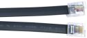
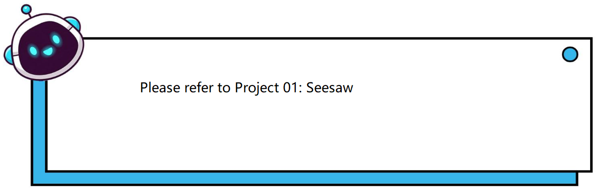
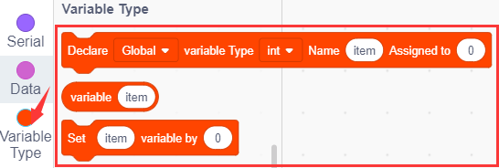

# Project 07：Conveyor

## 1. Overview
Conveyor is a machine that can drive itself and carry goods, which is applied in complex and dangerous industrial environments to reduce the labor intensity of workers and improve work efficiency. In this project, we will work to make a small conveyor.

## 2. Components
|||||
| :--: | :--: | :--: | :--: |
|Kidsuno Mainboard×1|Ultrasonic Adapter×1|Ultrasonic Sensor×1|360°Servo×1|
|||| |
|Connection Wire×1|USB Cable×1| Lego Series×1 | |
|||||

## 3. Installation 

Please refer to the following link：https://www.dropbox.com/scl/fo/dtu6zv41pd82c71yb65q8/h?rlkey=kzegu8g8jkjieaeqfjxif6kii&dl=0

## 4. Read the Value of Ultrasonic Sensor

## 5. Programming Steps

#### Step1：Wiring Diagram

Connect the kidsuno mainboard and computer via a USB cable, connect the ultrasonic adapter module to the No. 9 interface of the mainboard. The Vcc, Trig, Echo, and Gnd of the ultrasonic sensor are correspondingly inserted into the same pins of the ultrasonic adapter module. Connect the 360° servo to the G, V and D13 interface of the mainboard. The brown wire is connected to G, the red wire is connected to V and the orange wire is connected to D13.

#### Step2：Add the Ultrasonic Sensor
Tap the "Sensor" module in the "Extension" , then select "**Ultrasonic Sensor**" and click to return to the programming interface.

Diagram of the **Extension** Instruction Block

“**Ultrasonic Sensor**” Instruction Block

#### Step3: Description of Building Blocks

This block is used to measure distance to the specified pin, and the distance unit can be cm or inch.

#### Step4：Write the Program
① Drag the instruction block in the **Events** module to the script area.

②  Drag the instruction block in the **Serial** module to the script area and take the baud rate 9600 as an example.

③ Drag the instruction blockin the **Pins** module to the script area and copy it. Since the ultrasonic sensor is connected to the No. 9 interface on the mainboard (Trig corresponds to D10 pin, Echo corresponds to D11 pin), then change the number 0 to 10 and 11 respectively, and  change the " **Input**" behind the number 10 to "**Output**".

④ Drag the instruction block  in the **Control** module to the script area.

⑤ Drag the instruction block in the **Serial** module to the script area.

⑥ Drag the instruction block in the **Ultrasonic Sensor** module to the script area，then change the number 2 to 10 and 6 to 11.

⑦ Drag the instruction block in the **Control** module to the script area and change the number 1 to 0.3.

⑧ Complete Program

#### Step5：Test Result
Clickto upload the complete program to the kidsuno mainboard and power up, then  click  in the serial monitor area to set the baud rate to 9600. Move your hand in front of the ultrasonic sensor, when you get close to the ultrasonic sensor, you can see that the displayed distance value becomes smaller, otherwise it becomes larger.

## 6. Ultrasonic Sensor Controls Conveyor

## 7. Programming Steps

#### Step1: Description of Building Blocks

This block is used to initialize the OLED's width, height and an I2C address.

This is a command block for drawing a straight line from the initial position x0:0 y0:0 to the final position x1:32 y1:16. The number in the block can be changed.

This is a command block that draws a recta with a width of 32 and a height of 16 from the initial position x:0 y:0, the numbers can be changed.

This is a command block that draws a rectangle with a width of 32 and a height of 16 from the initial position x:0 y:0, the numbers can be changed.

This is the command block that draws a circle with a radius of 8 starting from the initial position x:16 y:16.

This is the command block that fills a circle with a radius of 8 starting at an initial position of x:16 y:16.

This is the command block that draws a round rectangle with width 32, height 16, and radius 4 starting from an initial position of x:16 y:16.

This is the command block that fills a round rectangle with width 32, height 16 and radius 4 starting from initial position x:16 y:16.

This is the command block to draw a triangle from three positions x0:0 y0:0, x1:16 y1:0 and x2:8 y2:16.

This is the command block that fills the triangle between the three positions x0:0 y0:0, x1:16 y1:0 and x2:8 y2:16.

This is a command block for setting text size and color and background color.

This is the command block that sets the cursor position.

This is a command block for setting the way of printing strings on the OLED screen. "**warp"** means newline printing, "**no-warp**" means no newline printing.

This is the command block to set the OLED display pattern.

This is the command block to clear the OLED screen.

This is the command block to refresh the OLED screen and display the next content.

This is a command block that sets strings to start scrolling in a certain direction.

This is the command block to set stop scrolling

#### Step2: Flow Chart
Set the 360° servo to 90°, and read the distance value detected by the ultrasonic sensor. When the ultrasonic sensor detects that the distance from the object is greater than 1cm and less than 13cm, the conveyor starts to transport the object, and the OLED displays "Objects"; otherwise, the conveyor stops working and the OLED displays "No object".

#### Step3：Add **Servo **

#### Step4：Write the Program

①  Find building blocks
（1）
 
（2）
 
（3）
 
（4）
 
（5）
 
（6）
 
（7）
 
（8）
 
（9）
 
（10）
 
② Complete Program

#### Step5：Test Result
Clickto upload the complete program to the kidsuno mainboard and power up, then put a larger object such as a sensor module on the track of the conveyor.

When the ultrasonic sensor detects that the distance from the object is greater than 1cm and less than 13cm, the conveyor starts to transport the object, and the OLED displays "Objects"; otherwise, the conveyor stops working and the OLED displays "No object".

## 8. Expansion Project

The sample code is below：

