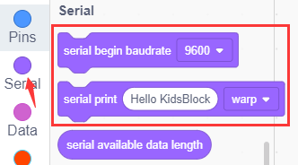
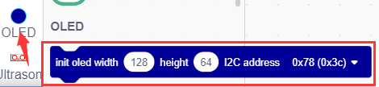

# Project 08：Large Crane

## 1. Overview
Crane is a machine that integrates loading, transportation and unloading, which is widely used in ports, workshops, electric power as well as construction sites. In this project, we will seek to make a large crane.

## 2. Components
|||| 
| :--: | :--: | :--: |
|Kidsuno Mainboard×1|IR Receiver×1|IR Remote Control×1|
||||
|360°Servo×1|270°Servo×1|Connection Wire×1|
||||
|USB Cable×1| Lego Series×1 |Wire×1|
|||||

## 3. Installation 

Please refer to the following link：https://www.dropbox.com/scl/fo/dtu6zv41pd82c71yb65q8/h?rlkey=kzegu8g8jkjieaeqfjxif6kii&dl=0

## 4. Read the Button Value of IR Remote Control

## 5. Programming Steps

#### Step1：Wiring Diagram

Connect the kidsuno mainboard and computer via a USB cable, connect the IR receiver module to the No. 2 interface of the mainboard. Then connect the 270° servo to the G, V and D12 interface, the brown wire is connected to G, the red wire is connected to V and the orange wire is connected to D12, the 360° servo to the G, V and D13 interface of the mainboard(brown wire: G, red wire: V , orange wire: D13).

#### Step2：Add the  IR Receiver 
Tap the "Communication" module in the "Extension" , then select " ** IR Receiver ** " and click to return to the programming interface.

Diagram of the **Extension** Instruction Block

Add “**IR Receiver **”

#### Step2: Description of Building Blocks

This block is used to initiate IR receiver to the specified pin.

This block is used to receive data from the IR remote control.

This block is used to read received IR data.

This block is used to refresh the IR received data and receive the next value.

#### Step3：Write the Program
①  Drag the instruction block in the **Events** module to the script area.

② Drag the instruction block in the **Serial** module to the script area and take the baud rate 9600 as an example.

③ Drag the instruction blockin the **IR Remote** module to the script area, since the IR receiver  module is connected to the D6 pin of the No. 2 interface on the mainboard, then change the number 2 to 6.

④ Drag the instruction block in the **Control** module to the script area.

⑤ Drag the instruction block  in the **Control** module to the script area.

⑥ Drag the instruction blockin the **IR Remote** module to the script area and place it into .

⑥ Drag the instruction block in the **Serial** module to the script area, then change “**warp**” to “**HEX**”.

⑥Drag the instruction blockin the **IR Remote** module to the script area and place it into

.

Drag the instruction blockin the **IR Remote** module to the script area.

⑦ Drag the instruction block in the **Control** module to the script area and change the number 1 to 0.05.

⑧ Complete Program

#### Step3：Test Result
Clickto upload the complete program to the kidsuno mainboard and power up, pull out the transparent sheet at the bottom of the IR remote control, then pull out the button slot, and then put in the battery(“**+**”pole is downward )and insert into the slot.

 Battery type：CR2025（provided by yourself）.

Then  click  in the serial monitor area to set the baud rate to 9600. Point the IR remote control to the IR receiver module, press a button on the IR remote control, and you will see a coded value in the serial monitor. Press the same key multiple times to make sure the value is correct. If you see FFFFFFFF, ignore it.

## 6. IR Remote Controls Large Crane

## 7. Programming Steps

#### Step1: Flow Chart

|Setting|set 360° servo to 90°，270° servo rotates from 0° to180°（object raises）and OLED displays “”pattern|
| :--: | :--: |

|  | Value：FF22DD | State |Crane turns left and OLED displays “←” pattern|
| :--: | :--: | :--: | :--: |
|| Value：FFC23D | State |Crane turns right and OLED displays “→” pattern|
| | Value：FF629D |State |Object raises and OLED displays“↑” pattern|
| |Value：FFA8573 |State |Object lowers and OLED displays “↓” pattern|

#### Step3：Add **Servo **

#### 

#### Step4：Write the Program

①  Find building blocks
（1）
 
（2）
 
（3）
 
（4）
 
（5）
 
（6）
 
（7）
 
（8）
 
（8）
 

② Complete Program

#### Step5：Test Result
Clickto upload the complete program to the kidsuno mainboard and power up, the object raises and OLED displays“” pattern. Press , crane turns left and OLED displays “←” pattern, press , crane turns right and OLED displays “→” pattern, press , object raises and OLED displays“↑” pattern, press , object lowers and OLED displays “↓” pattern.

