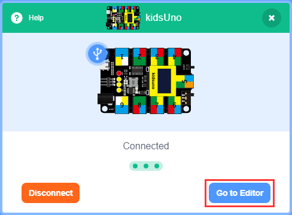
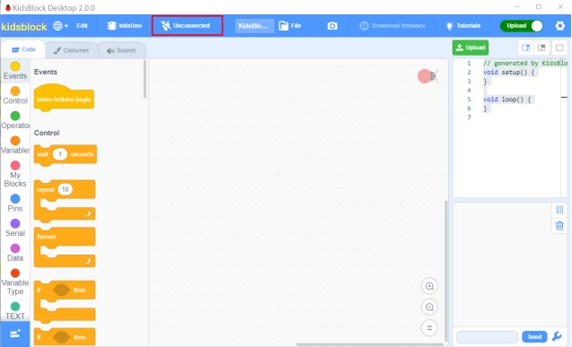
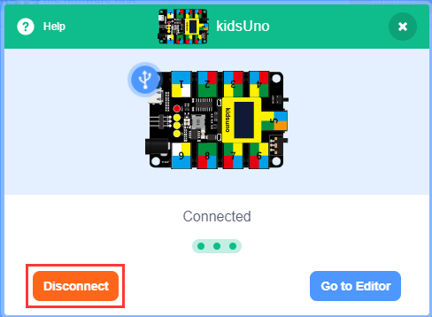
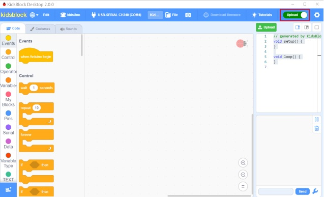
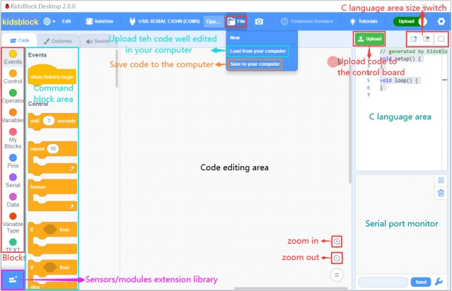
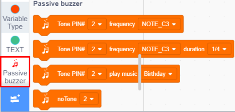
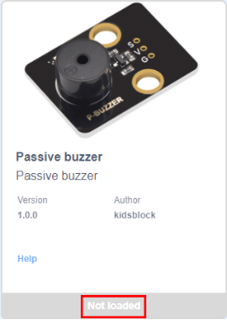
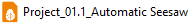
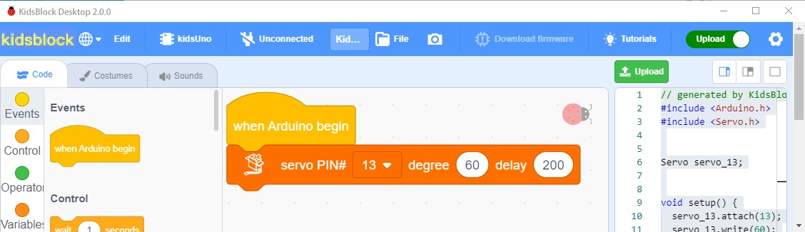
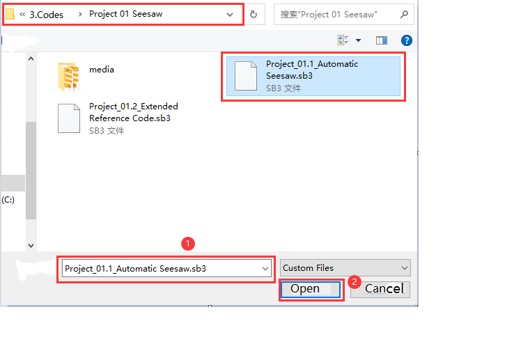

# KidsBlock Development Environment Configuration

Link for the KidsBlock Development Environment Configuration：[https://kidsblocksite.readthedocs.io/en/latest/](https://kidsblocksite.readthedocs.io/en/latest/)

**Note:** The control board in this kit adopts kidsUno. For importing kidsUno mainboard and library and uploading example codes, please refer to the followings:

1.Click to enter the main page, and select the control board needed. In this project, we select the kidsUno mainboard and click **Connect**, then it is connected.
Click Go to Editor to return the code editor. 
Icon will change into  and  will change into . This means the kidsUno mainboard and ports（COM）are connected.  

2.If the kidsUno mainboard is connected , but icon doesn’t change into . You need to click to connect the COM port.
Click. Then you will find a page pop up, showing Connected.

To disconnect the port, just click and Disconnect.

3.The kidsUno mainboard and the COM port are connected, then  automatically switches to .

Note：If you want to update libraries of KidsBlock, click then Clear cache and restart.

4.stands for extension libraries of sensors and modules. 
Click to enter the page of extension libraries, click a sensor or module to add. For example, if click the **passive buzzer** module,**Not loaded** will change into **Loaded**. Then the passive buzzer is added.

Click to return to the code editor. Then you can view the passive buzzer in the blocks area.

If you want to delete the **passive buzzer**, click to select the passive buzzer. Then **Loaded** will change into **Not loaded**. Then the passive buzzer is deleted.

The way of deleting other sensors or modules is as same as the passive buzzer.

5.How to open SB3 type files：

The first method：Double-click SB3 type files to open them.
For instance, open, then we need to double-click it.

The second method: Open Kidsblock，click **file** and **Load from your computer**，then select the SB3 type file on the computer.（for example）

