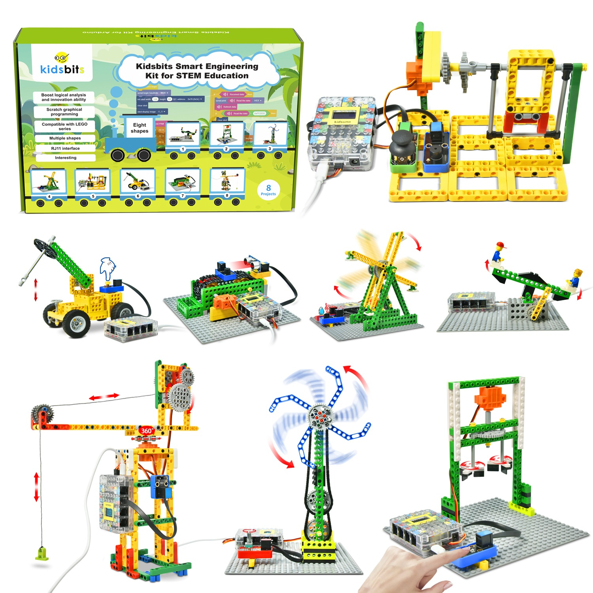
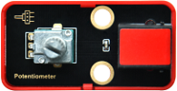
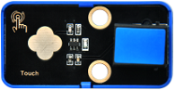
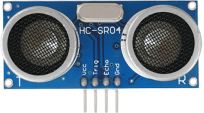
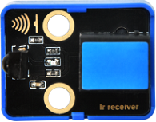
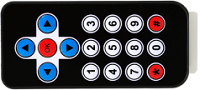
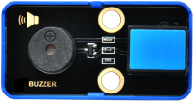
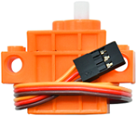
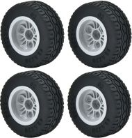
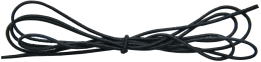

**Kidsbits Smart Engineering Kit for STEM Education**

# Product Introduction

Based on Arduino and compatible with Lego series, smart engineering is a kidsbits STEM project committed to programming education for children aged 9-12. It integrates multiple sensors and modules such as a steam sensor, a rotary potentiometer as well as an ultrasonic adapter. On this very note, it is easy for you to DIY some intriguing projects including a mixer, a rope skipping machine, a breaker, a conveyor and a large crane.

Notably, Scratch graphical programming software allows children to learn from the simplest codes and master systematic programming knowledge. What’s more, the Lego series can be used to build various shapes and inject some basic physics and mechanical knowledge to children, thus greatly enhancing their logical analysis ability, creative ability, hands-on ability and problem-solving ability.

# Kit
| # | Component | QTY | Picture |
| :--: | :--: | :--: |:--: |
| 1 | Kidsuno Mainboard | 1 |  |
| 2 | Button Module | 1 |  |
| 3 | Steam Sensor | 1 |  |
| 4 | Rotary Potentiometer |1 | |
| 5 | Digital Capacitive Touch Sensor | 1 | |
| 6 | Ultrasonic Adapter | 1 | |
| 7 | Ultrasonic Sensor | 1 | |
| 8 | IR Receiver | 1 | |
| 9 | IR Remote Control | 1 | |
| 10 | Passive Buzzer | 1 | |
| 11 | Joystick Module | 1 | |
| 12 | 360°Servo | 1 |  |
| 13 | 270°Servo | 1 | |
| 14 | USB Cable | 1 | |
| 15 | 20cm Connection Wire | 4 |  |
| 16 | 30cm Connection Wire | 3 |  |
| 17 | Battery Holder | 1 | |
| 18 | Lego Series | 1 ||
| 19 | Wheel | 4 ||
| 20 | Wire | 1 ||

# Download link

- [Codes](Codes.zip)

- [Installation_Steps](Installation_Steps.zip)

# Mainboard Introduction

[Mainboard_Introduction](Mainboard_Introduction/kidsuno_Mainboard_Introduction.md)

# Development Environment Configuration

[Development_Environment_Configuration](Development_Environment_Configuration/KidsBlock_Development_Environment_Configuration.md)

# Projects

[Projects](Projects/3.Projects.md)

