# Kidsbits Smart Engineering Kit for STEM Education

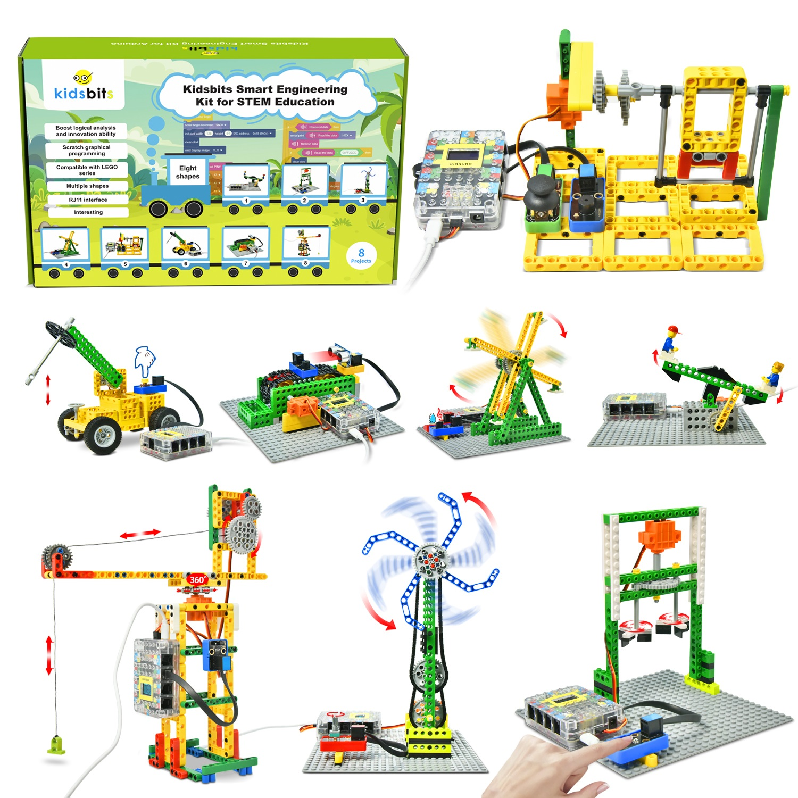

# Download project code

 [Project Codes](Codes.zip)

# Introduction

Based on Arduino and compatible with Lego series, smart engineering is a kidsbits STEM project committed to programming education for children aged 9-12. It integrates multiple sensors and modules such as a steam sensor, a rotary potentiometer as well as an ultrasonic adapter. On this very note, it is easy for you to DIY some intriguing projects including a mixer, a rope skipping machine, a breaker, a conveyor and a large crane.

Notably, Scratch graphical programming software allows children to learn from the simplest codes and master systematic programming knowledge. What’s more, the Lego series can be used to build various shapes and inject some basic physics and mechanical knowledge to children, thus greatly enhancing their logical analysis ability, creative ability, hands-on ability and problem-solving ability.

# Kit list:
| # | Component | QTY | Picture |
| :--: | :--: | :--: |:--: |
| 1 | Kidsuno Mainboard | 1 | 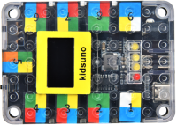 |
| 2 | Button Module | 1 |  |
| 3 | Steam Sensor | 1 |  |
| 4 | Rotary Potentiometer |1 | |
| 5 | Digital Capacitive Touch Sensor | 1 |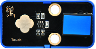 |
| 6 | Ultrasonic Adapter | 1 |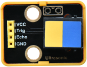 |
| 7 | Ultrasonic Sensor | 1 |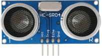 |
| 8 | IR Receiver | 1 | |
| 9 | IR Remote Control | 1 | |
| 10 | Passive Buzzer | 1 |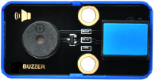 |
| 11 | Joystick Module | 1 |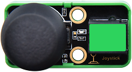 |
| 12 | 360°Servo | 1 | 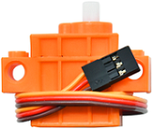 |
| 13 | 270°Servo | 1 | |
| 14 | USB Cable | 1 | |
| 15 | 20cm Connection Wire | 4 | 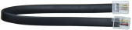 |
| 16 | 30cm Connection Wire | 3 | 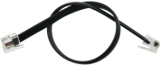 |
| 17 | Battery Holder | 1 |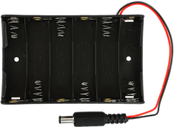 |
| 18 | Lego Series | 1 ||
| 19 | Wheel | 4 ||
| 20 | Wire | 1 ||

# Kidsuno Mainboard Introduction

 Introduction：
Arduino STEM electronic building block programming development controller is a board based on the ATmega328P microcontroller. It boasts 14 digital input or output pins (6 of which can be used as PWM output), 8 analog inputs (A4 and A5 as fixed I2C), two row pin ports, a USB port, a DC power port, a DC power switch, a reset button and a 128*64 OLED display.

Importantly, we enable to connect it to a computer via a USB-C cable, or use a DC adapter or batteries to power it.

 Parameters：
- Microcontroller：ATmega328P
- Operating Voltage：5V
- Input Voltage：USB:5V,DC:6-12V
- Digital I/O Pins：14(of which 6 provide PWM output
- PWM Digital I/O Pins：6
- Analog Input Pins：8（A4 and A5 as fixed I2C）
- DC Current per I/O Pin：20mA
- Flash Memory：32KB(ATmega328P)of which 0.5 KB used by bootloader
- SRAM：2KB(ATmega328P)
- EEPROM：1KB(ATmega328P)
- Total Current： The max output of USB power supply is 400mA，and DC is 1.6A
- Max Power：8W
- Clock Speed：16MHZ
- Dimensions：87.5mm×60mm×20mm
- Weight：37g(without housing)
- Operating Temperature Range：-10℃~50℃ 

 Schematic Diagram：

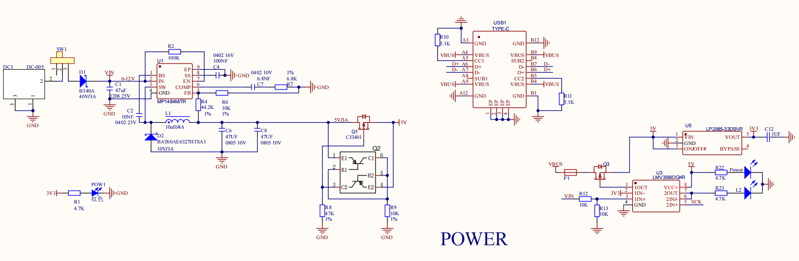

 Ports Description of Kidsuno Mainboard

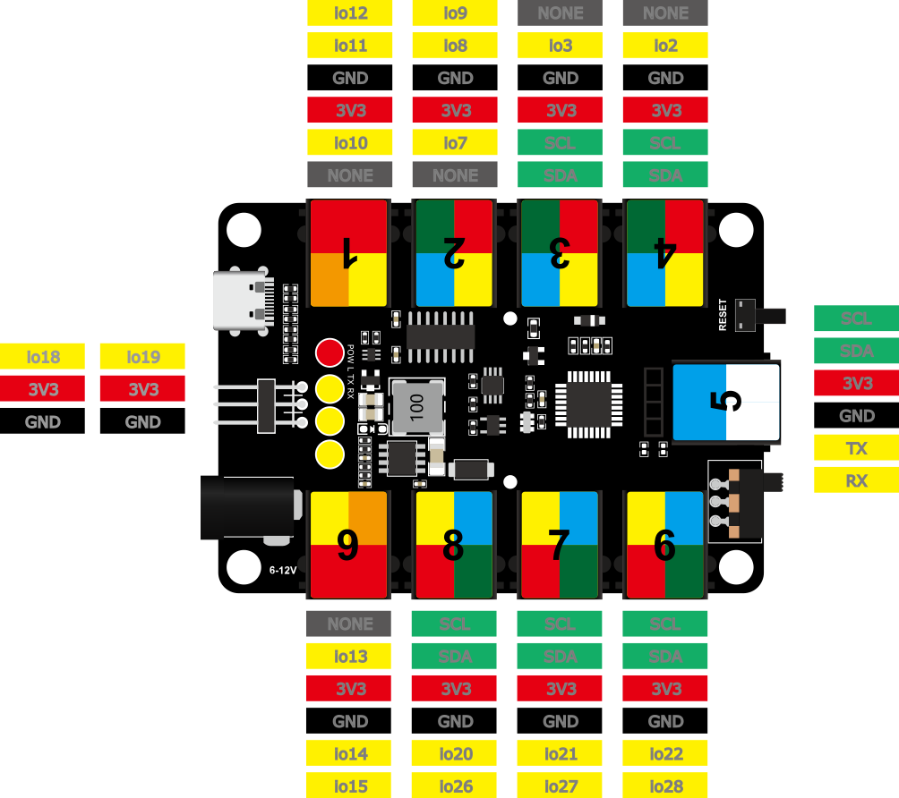

 Mainboard External Battery Holder

The end of the battery holder with the spring is negative pole (-), and the other is positive pole (+). (AA batteries are not provided)

## 3. Tutorial：

- [1.Mainboard_Introduction](1.Mainboard_Introduction/kidsuno_Mainboard_Introduction.md)

- [2.Development_Environment_Configuration](2.Development_Environment_Configuration/KidsBlock_Development_Environment_Configuration.md)

- [3.Projects](3.Projects/3.Projects.md)

- [4.Codes](4.Codes.zip)

